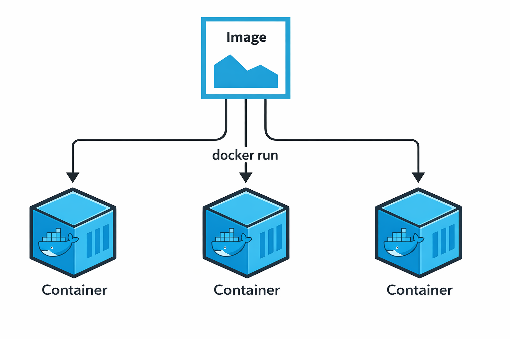
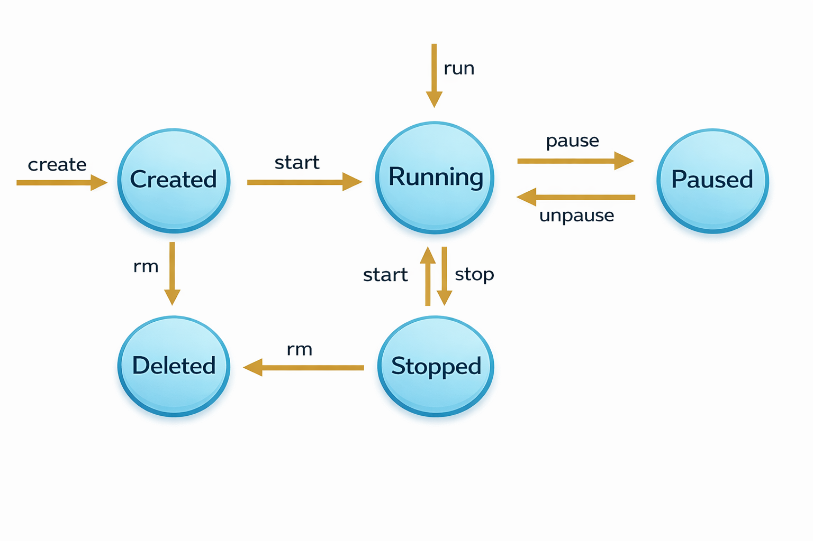
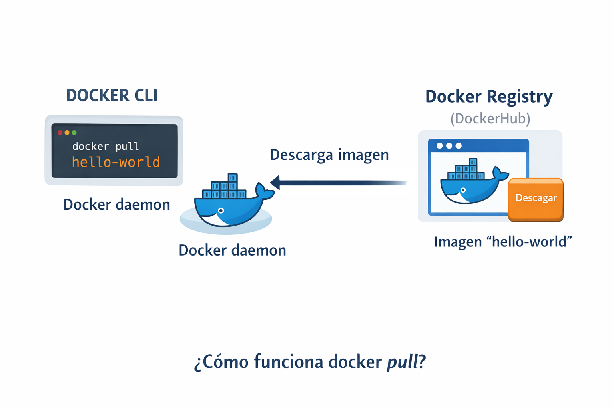
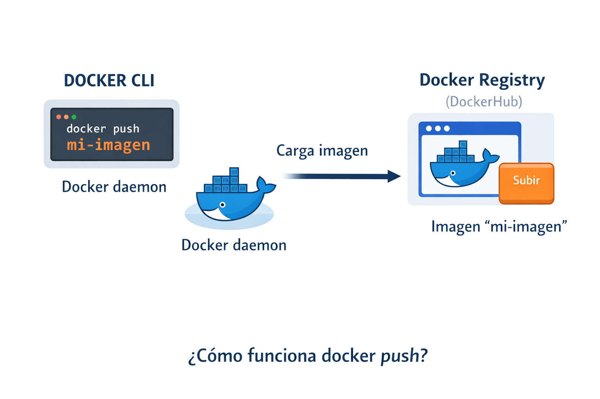
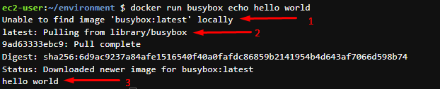
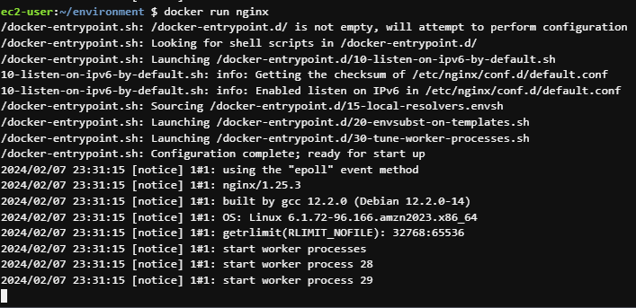
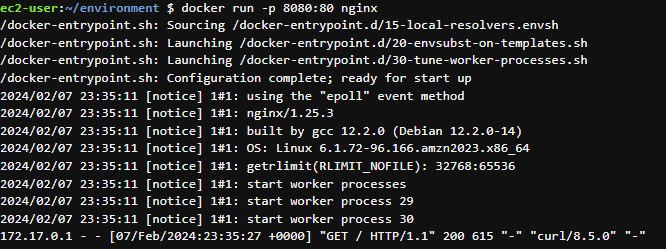
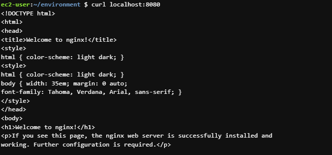
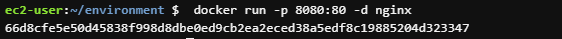

# Imagenes y contenedores

Las imágenes de Docker son plantillas inmutables de solo lectura que contienen el código, bibliotecas y configuraciones necesarias para ejecutar una aplicación. Los contenedores son las instancias de esas imagenes en ejecución, aisladas y ligeras, creadas a partir de estas imágenes. Es decir puedo usar una imagen para arrancar varios contenedores.

<p align="center">

</p>

Podemos buscar imagenes en diferentes registries como:
+ Docker Hub
+ Quay
+ AWS ECR public galery

### Ciclo de vida de un contenedor
<p align="center">

</p>

## Trabajando con imágenes

Una imagen de Docker es una plantilla de solo lectura que define al contenedor. La imagen contiene el código que se ejecutará, incluida cualquier definición para cualquier biblioteca o dependencia que el código necesite.

### Principales comandos

Para poder trabajar con las imágenes utilizaremos el comando docker de la siguiente forma "docker image [comando]"

#### docker image pull

<p align="center">

</p>

Permite descargar una imagen de un registro

```sh
$ docker image pull NAME[:TAG]
```

El siguiente comando es equivalente

```sh
$ docker pull NAME[:TAG|@DIGEST]
```

Ejemplo de uso:

Deseamos descargar la imagen oficial de python, para ello nos dirigimos a docker hub en la siguiente url https://hub.docker.com/_/python

Si deseamos descargar la imagen de python con la etiqueta 3.12.1 lanzamos el siguiente comando:

```sh
$ docker pull python:3.14.5
```

También podemos hacerlo mediante el digesto

```sh
 $ docker pull python@sha256:2081144b23b38daa7fae3b7ee4b42cf2f858d88b0452736274aafaba96f3a6b6
 ```

#### docker image push

<p align="center">

</p>

Este comando permite subir las imágenes en el registro de Docker Hub o AWS ECR.

```sh
$ docker image push [OPTIONS] NAME[:TAG]
```

En secciones posteriores de este curso cubriremos con mas detalle este comando

#### docker image inspect

Muestra información detallada sobre una o más imágenes.

```sh
$ docker image inspect [IMAGE...]
```

#### docker image ls

Este comando mostrará todas las imágenes de nivel superior, su repositorio, etiquetas y su tamaño.

 ```sh
$ docker image ls
```

Para ver los digestos lanzaremos el siguiente comando

```sh
$ docker image ls --digests
```

Para ver todas las imágenes incluyendo las capas intermedias usaremos

```sh
$ docker image ls --all
```

#### docker rm

Para eliminar una o mas imágenes corremos el comando

```sh
$ docker image rm [IMAGE...]
```
#### docker sarch

Nos permite buscar imagenes en dockerhub. El siguiente comando me permite buscar imagenes de node en Dockerhub

```sh
$ docker seach node
```

## Trabajando con contenedores

Un contenedor de Docker es un contenedor ejecutable, independiente, ligero que integra todo lo necesario para ejecutar una aplicación, incluidas bibliotecas, herramientas del sistema, código y runtime.

## Principales comandos

#### Hello world en docker
Vamos a ejecutar el clasico "hello world" en docker con el siguiente comando

```sh
$ docker run busybox echo hello world
```

veremos un resultado similar al mostrado en la siguiente imagen

<p align="center">

</p>

A continuacion vamos a explicar cada uno de los sucesos

1 Aqui Docker intenta buscar la imagen busybox en su repositorio local

2 Como no encontro la imagen la empieza a descargar

3 Ejecuta el comando enviado al contenedor "echo hello world"

##### docker container ls

Lista los contenedores

```sh
$ docker container ls [OPTIONS]
```

Los comandos equivalente son los siguientes

```sh
$ docker container list
$ docker container ps
$ docker ps
```

Importante! El comando nos mostrara los contenedores en estado RUNNING, pero si queremos ver todos los contenedores debemos agregar cualquiera de las siguientes banderas

```sh
$ docker ps -a
$ docker ps --all
```

##### docker container run

El comando docker run ejecuta un comando en un nuevo contenedor, descargando la imagen si es necesario y arrancando el contenedor.

```sh
$ docker container run [OPTIONS] IMAGE [COMMAND] [ARG...]
```

El comando equivalente es el siguiente

```sh
$ docker run [OPTIONS] IMAGE [COMMAND] [ARG...]
```

##### docker container run (Ejemplo)

A continuación vamos a correr el servidor nginx paso a paso revisando cada uno de las opciones disponibles junto al comando run para dejar corriendo nuestro servidor.

1 Vamos a arrancar nuestro contenedor nginx

```sh
$ docker run nginx
```

Vamos a ver que nuestro shell se quedara atachado a los logs del contenedor

<p align="center">

</p>
Para detener el contenedor presionamos "ctrl + C"

2 Para obtener una respuesta de nustro servidor vamos a enlazarlo a un puerto, para ello lanzamos el siguiente comando

```sh
$ docker run -p 8080:80 nginx
```

Con la bandera -p asignamos un puerto del host al puerto del contenedor (-p host_port:container_port)

Para realizar una petición http al servidor dentro del contenedor vamos a lanzar el siguiente comando desde una consola diferente a la que se encuentra corriendo el contenedor (también podríamos hacer la petición desde nuestro navegador web)

```sh
$ curl localhost:8080
```

En la siguiente imagen correspondiente a los logs del contenedor, vemos en la ultima linea que el servidor nginx recibió la petición y retorno la respuesta

<p align="center">

</p>

Por otro lado en la pestaña donde hicimos curl, verificamos que la respuesta fue el html de bienvenida de nginx

<p align="center">

</p>

4 Para correr el servidor nginx como demonio y que no se nos quede atachado a la consola vamos a utilizar la bandera "-d" (d por la palabra DETACHED)

```sh
$ docker run -p 8080:80 -d nginx
```

vamos a ver que el contenedor empieza a correr desatachado de la consola

<p align="center">

</p>

5 Para agregar un nombre a nuestro contenedor vamos lanzar el siguiente comando

```sh
$ docker run --name mynginx -p 8081:80 -d nginx
```

> [!NOTE]
> Cuando lanzamos el comando run se inicia un proceso o un conjunto de procesos aislados. Cuando lanzamos el comando ```docker run busybox echo hello world```, el contenedor realiza la tarea de imprimir en pantalla y luego se detiene. Por otro lado, cuando lanzamos el comando ```docker run nginx```, el contenedor tiene la tarea de escuchar peticiones de manera constante; mientras no se detenga el contenedor o no encuentre un error en su ejecución, este proceso va a seguir trabajando.

##### docker container attach

Para volver atachar a un contenedor que arranco con el modo DETACHED (-d) lanzamos el comando 

```sh
$ docker attach stop [CONTAINER...]
```
El comando equivalente es el siguiente

```sh
$ docker attach [CONTAINER...]
```

##### docker container stop (SIGTERM)

Envia una señal al contenedor o contenedores para detener su ejecucion

```sh
$ docker container stop [CONTAINER...]
```
El comando equivalente es el siguiente

```sh
$ docker stop [CONTAINER...]
```

##### docker container restart

Despues que se ha detenido un contenedor con el comando "stop" este se puede reiniciar

```sh
$ docker container restart [CONTAINER...]
```
El comando equivalente es el siguiente

```sh
$ docker restart [CONTAINER...]
```

##### docker container pause (SIGSTOP)

Envia una señal al contenedor o contenedores para pausar su ejecucion

```sh
$ docker container pause [CONTAINER...]
```
El comando equivalente es el siguiente

```sh
$ docker pause [CONTAINER...]
```

##### docker container unpause

Despues que se ha pausado un contenedor con el comando "pause" este se puede despausar

```sh
$ docker container unpause [CONTAINER...]
```
El comando equivalente es el siguiente

```sh
$ docker unpause [CONTAINER...]
```

##### docker container rm

Elimina uno o más contenedores. Para poder utilizar este comando el contenedor debe estar detenido. No se podra eliminar contenedores en estado RUNNING

```sh
$ docker container rm [CONTAINER...]
```

El comando equivalente es el siguiente

```sh
$ docker container remove [CONTAINER...]
$ docker rm [CONTAINER...]
```

##### docker container exec

El comando docker exec ejecuta un nuevo comando en un contenedor en ejecución.

El comando que especifica con Docker Exec solo se ejecuta mientras se ejecuta el proceso principal del contenedor (PID 1) y no se reinicia si se reinicia el contenedor.

```sh
$ docker container exec CONTAINER COMMAND 
```
El comando equivalente es el siguiente

```sh
$ docker exec CONTAINER COMMAND 
```

Ejemplo:

Normalmente vamos a requerir acceder a un contenedor que se encuentra corriendo para revisar algunos archivos, para esto utilizaresmo el comando exec para ingresar al contenedor usando bash

```sh
$ docker exec -it CONTAINER bash 
```

##### docker container logs

El comando Docker Logs recupera por lotes los registros presentes en el momento de la ejecución.

```sh
$ docker container logs CONTAINER
```
El comando equivalente es el siguiente

```sh
$ docker logs CONTAINER
```

Si deseas ver los logs en tiempo real, debe lanzar el siguiente comando

```sh
$ docker logs --follow CONTAINER
```

##### docker container diff 

Muestra los archivos y directorios modificados en el sistema de archivos de un contenedor desde que se creó el contenedor.

```sh
$ docker container diff CONTAINER
```

El comando equivalente es el siguiente

```sh
$ docker diff CONTAINER
```
Muestra 3 estados
 
- A: Added
- D: Deleted
- C: Changed
