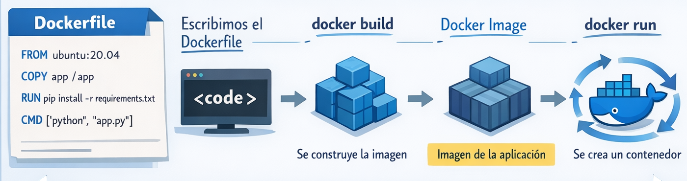
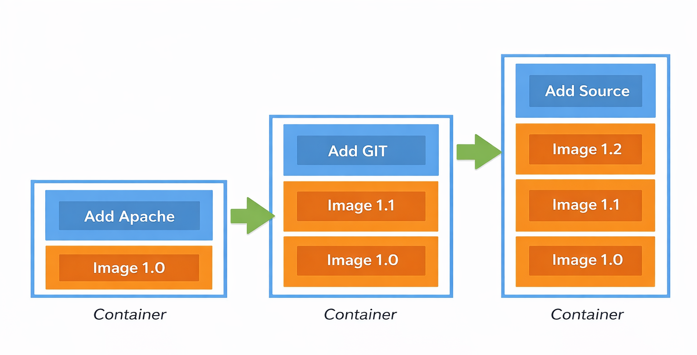

# Dockerfile

Un Dockerfile es un archivo o documento de texto simple que incluye una serie de instrucciones que se necesitan ejecutar de manera consecutiva para cumplir con los procesos necesarios para la creación de una nueva imagen.
<p align="center">

</p>


## Estructura

El dockerfile puede contener los siguinetes elementos:
```sh
FROM: Permite especificar la imagen base.
MAINTAINER: Especifique el autor de una imagen.
RUN: Ejecute comandos de compilación
WORKDIR: Cambiar directorio de trabajo.
COPY: Copiar archivos y directorios.
ADD: Agregue archivos y directorios locales o remotos.
EXPOSE: Describe en qué puertos escucha tu aplicación.
VOLUME: Crea un volumen para montar.
ENV: Establece variables de entorno.
ARG: Utilice variables de tiempo de construcción.
ENTRYPOINT: Especifica el ejecutable predeterminado.
CMD: Especifique comandos predeterminados.
```

## Capas

Hay dos principios importantes de las imágenes:
+ Las imágenes son inmutables. Una vez que se crea una imagen, no se puede modificar. Solo se puede crear una nueva imagen o agregar cambios sobre ella.
+ Las imágenes se componen de capas. Cada capa representa un conjunto de cambios en el sistema de archivos que agregan, eliminan o modifican archivos.

<p align="center">

</p>

Cada instrucción de un Dockerfile (como RUN, COPY) crea una nueva capa con los cambios específicos, lo que permite reutilizar capas compartidas, optimizar el almacenamiento, acelerar las compilaciones y simplificar las actualizaciones incrementales

Para ver las capas tenemos que ver el campo "RootFS" al lanzar el comando:

```sh
$ docker inspect [IMAGE...]
```

## Contruyendo un contenedor

### Build

El comando docker build se utiliza para construir una imagen de Docker a partir de un Dockerfile y un "contexto" de archivos. 

### Construyendo una aplicacion simple para calcular el factorial de un numero

Vamos a posicionarnos en la carpeta factorial dentro de este repositorio. Luego vamos a lanzar el siguiente comando para empezar la construccion del contenedor

```sh
$ docker build -t factorial .
```

Una vez que el build fue exitoso, vamos a lanzar el contenedor

```sh
$ docker run factorial 5
```
Vamos a ver que se nos muestra el resultado en pantalla

### Contruyendo una aplicacion Web

Vamos a posicionarnos en la carpeta flaskapp dentro de este repositorio. Luego vamos a lanzar el siguiente comando para empezar la construccion del contenedor

```sh
$ docker build -t myapp .
```

Una vez que el build fue exitoso, vamos a lanzar el contenedor

```sh
$ docker run -p 8000:8000 myapp
```

Cuando se crea una imagen, automáticamente se le agrega la etiqueta "latest"; nosotros podemos agregar etiquetas a las imágenes. Por ejemplo, si quisiéramos agregar la versión a la imagen, podemos agregar ":1.0.0" después del nombre de la imagen.

```sh
$ docker build -t myapp:1.0.0 .
```

### Pasar valores en tiempo de compilación

Vamos a crear el siguiente Dockerfile

Dockerfile
```sh
FROM alpine:latest
ARG APP_VERSION=1.0
RUN echo "Building version: $APP_VERSION"
```

Para construir la imagen usaremos el siguiente comando:
```sh
$ docker build --build-arg APP_VERSION=2.0 -t myapp:2.0 .
```

### Diferencias variables de entorno (ENV) y los argumentos de construcción

| Docker ARG (Build Argument) | Docker ENV (Environment Variable) | 
|---|---|
| Sólo disponible durante el proceso de creación de la imagen. | Disponible durante el proceso de compilación Y en el contenedor en ejecución. |
| No se conserva en los metadatos/capas de la imagen final. | Persistió en la imagen final y fue accesible en tiempo de ejecución. |
| Útil para configuraciones dinámicas como números de versión o feature flags. | Útil para configuraciones de tiempo de ejecución como claves API, URL de bases de datos, etc.|

### No cache

Para deshabilitar el uso de la caché de compilación y reconstruir todas las capas desde cero usamos el flag --no-cache .
