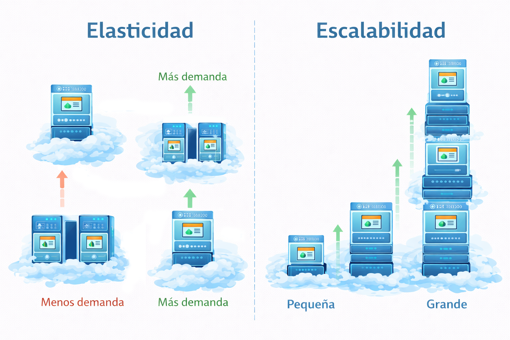
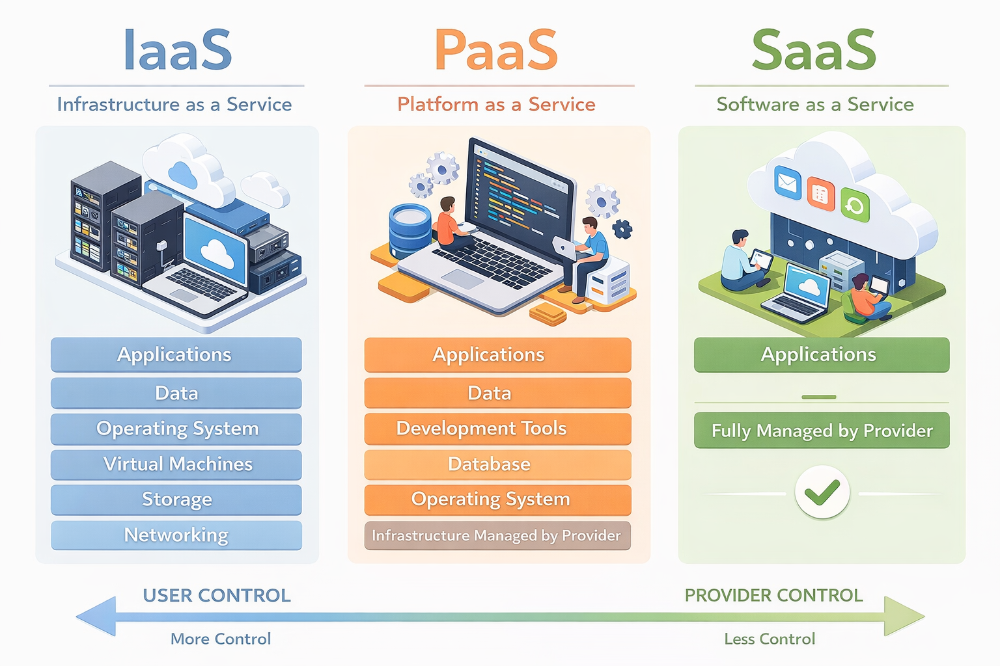
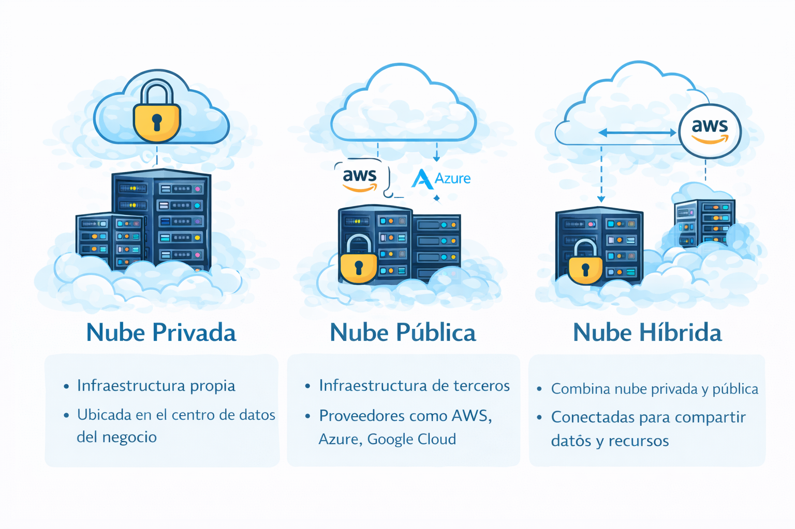
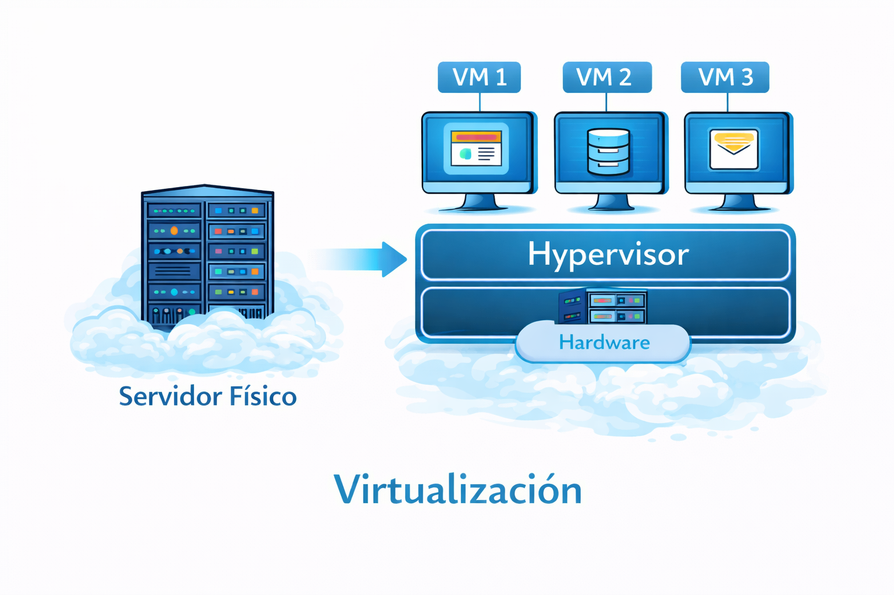
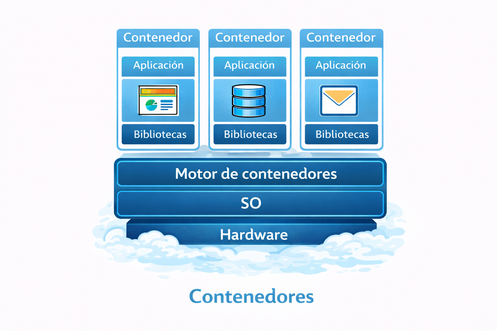
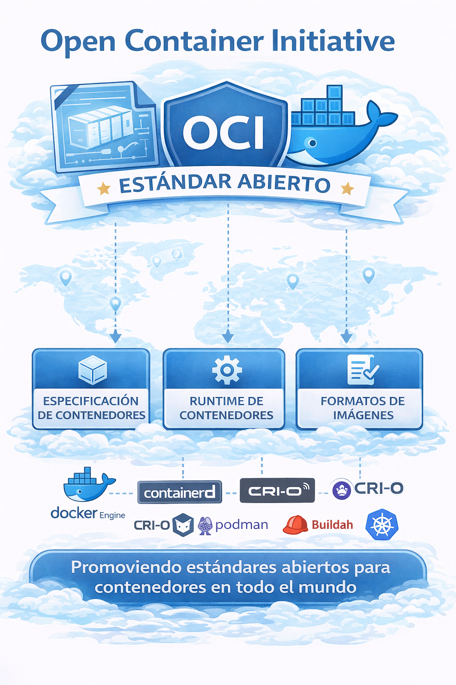
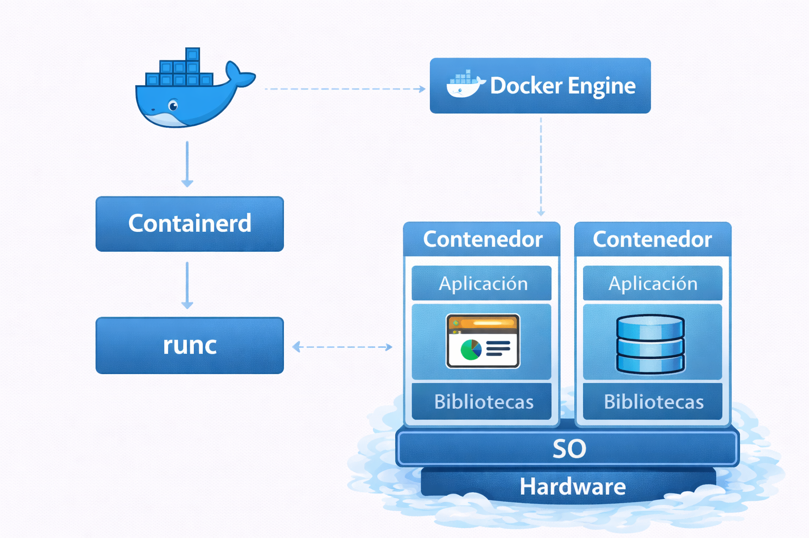
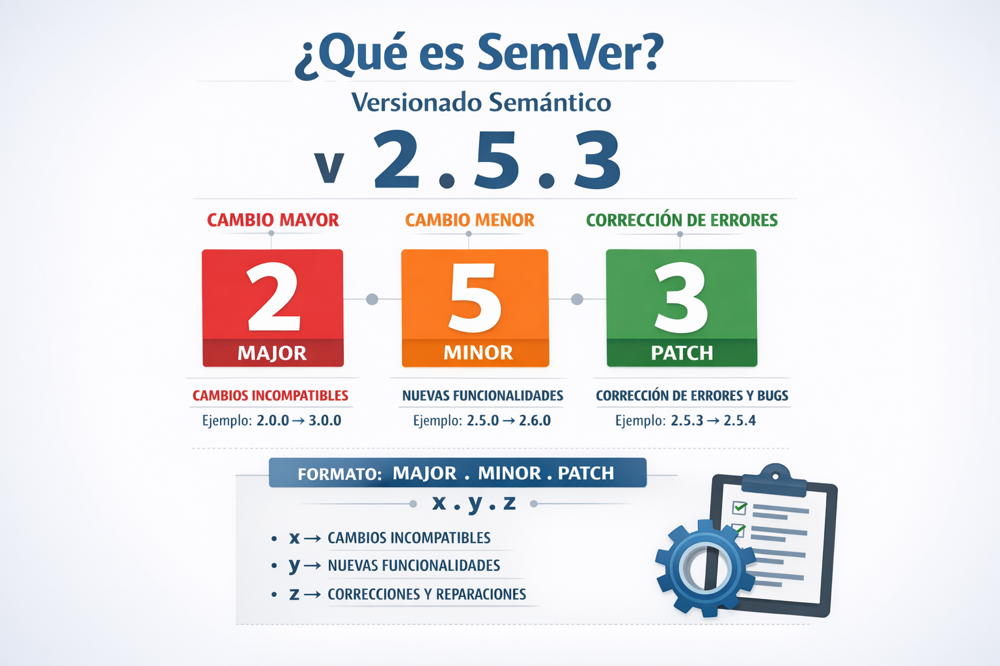

# Fundamentos

## Computacion en la nube

### Características

+ Recursos bajo demanda: El usuario puede aprovisionar recursos (servidores, almacenamiento, bases de datos) cuando los necesite.
+ Elasticidad: Se enfoca en ajustar recursos (aumentar o disminuir) automáticamente en tiempo real basándose en la demanda actual.
+ Escalabilidad: Se enfoca en crecer para manejar demandas crecientes.
+ Pago por uso: Se paga solo por lo que se consume (CPU, RAM, almacenamiento, transferencia de datos).
+ Alta disponibilidad: Los proveedores distribuyen servicios en múltiples centros de datos para evitar caídas.

<p align="center">

</p>

### Modelos de servicio en la nube

+ IaaS (Infrastructure as a Service) – Infraestructura virtualizada.
+ PaaS (Platform as a Service) – Plataforma para desarrollar aplicaciones.
+ SaaS (Software as a Service) – Software listo para usar.

<p align="center">

</p>

### Modelos de despliegue

+ Nube pública (AWS, GCP, Azure)
+ Nube privada (On-premise)
+ Nube híbrida (publica + privada)
+ Nube multicloud

<p align="center">

</p>

## Virtualización

+ Ejecutar varios sistemas operativos en una sola máquina física.
+ Cada sistema operativo se ejecuta en un entorno completamente aislado.
+ Gestionado u orquestado por un hipervisor.

<p align="center">

</p>

## Contenedores

+ Los contenedores permiten empaquetar una aplicación con todas sus dependencias (librerías, binarios, configuraciones) para que pueda ejecutarse de manera aislada y consistente en cualquier entorno.

<p align="center">

</p>

### Container vs Maquinas virtuales

+ A diferencia de una máquina virtual, los contenedores:
  + No incluyen un sistema operativo completo.
  + Comparten el kernel del sistema operativo host.
  + Son mucho más ligeros que una VM.


## Open Container Initiative (OCI)

La Open Container Initiative (OCI) es un proyecto colaborativo de la Linux Foundation creado en 2015 para establecer estándares abiertos y neutrales para la tecnología de contenedores. Define especificaciones técnicas para el formato de imágenes, su distribución y su tiempo de ejecución, garantizando la portabilidad y compatibilidad entre diferentes herramientas como Docker, Kubernetes y Podman.

Los aspectos clave de la OCI son:

+ Origen: Fue iniciada por Docker, CoreOS y otros líderes de la industria
+ Objetivo: Evitar la dependencia de un único proveedor y asegurar que un contenedor creado con una herramienta pueda ejecutarse en otra.

+ Especificaciones Principales:
  + Runtime Specification (runtime-spec): Define cómo se ejecuta un contenedor a partir de un sistema de archivos descomprimido.
  + Image Specification (image-spec): Estandariza el formato de las imágenes de contenedores.
  + Distribution Specification (distribution-spec): Estandariza la distribución de imágenes, basándose en la API HTTP V2 de Docker.

<p align="center">

</p>

### Container runtime:
  + De Bajo Nivel: Es el que realmente crea y ejecuta el contenedor en el sistema operativo.
    + runc
    + runsc
    + crun
  + De Alto Nivel: Gestiona el ciclo de vida completo del contenedor y utiliza internamente uno de bajo nivel para ejecutarlo.
    + CRI-O (usa: runc, crun)
    + containerd (usa runc)
    + gVisor (usa runsc)
+ Ejemplo Docker:
  + Runc: Es el componente de bajo nivel que crea los contenedores.
  + Containerd: Gestiona la transferencia de imágenes, almacenamiento y supervisión.
  + Docker Engine: Actúa como el orquestador principal, confiando en containerd para las tareas de ejecución.

<p align="center">

</p>

## Orquestación de contenedores

La orquestación de contenedores es el proceso de automatizar el despliegue, gestión, escalado y operación de múltiples contenedores en uno o varios servidores.

En vez de ejecutar contenedores manualmente, la orquestación permite que un sistema los administre automáticamente.

+ Orquestadores más usados
  + Kubernetes
  + Docker Swarm
  + Amazon ECS

+ Kubernetes administrado
  + Amazon EKS
  + AKS
  + GKE
   
## Kubernetes (K8s)

Kubernetes (también conocido como K8s) es una plataforma de orquestación de contenedores que permite automatizar el despliegue, escalado y administración de aplicaciones contenerizadas.

Fue creado originalmente por Google y actualmente es mantenido por la Cloud Native Computing Foundation.

### ¿Para qué sirve Kubernetes?

Cuando trabajas con contenedores (por ejemplo con Docker), puedes ejecutar aplicaciones fácilmente.
Pero cuando tienes muchos contenedores, en múltiples servidores, necesitas algo que los administre automáticamente. Ahí entra Kubernetes.

## Semantic Versioning (SemVer)

Kubernetes usa SemVer para:

+ Kubernetes Releases
+ API versions
+ Resource Definitions
+ Component Versions

El formato de SemVer es: MAJOR.MINOR.PATCH

+ MAJOR: Indica cambios incompatibles con versiones anteriores.
  + Ejemplo: 1.0.0 -> 2.0.0
+ MINOR: Indica nuevas funcionalidades compatibles con versiones anteriores.
  + Ejemplo: 1.0.0 -> 1.1.0
+ PATCH: Indica: bug fixes, parches de seguridad, pequeñas correcciones. No introduce cambios en la API.
  + Ejemplo: 1.0.0 -> 1.0.1

<p align="center">

</p>

## SLI, SLO, SLA

- **SLI — Service Level Indicator:** Un SLI es una métrica que mide el rendimiento o la calidad de un servicio.

  Ejemplos de SLIs:

  - Latencia de las peticiones
  - Tasa de errores
  - Disponibilidad del servicio
  - Tiempo de respuesta

- **SLO — Service Level Objective:** Un SLO es el objetivo o valor deseado para un SLI. Define qué tan bueno debe ser el servicio.

  Ejemplo:
  
  - SLI: Porcentaje de requests exitosas
  - SLO: El 99.9% de las solicitudes deben responder correctamente en 30 días

- **SLA — Service Level Agreement:** Un SLA es un contrato formal entre el proveedor del servicio y el cliente.
  Define:
  
  - El nivel mínimo de servicio
  - Penalizaciones si no se cumple. 

  Ejemplo:
  - El servicio tendrá una disponibilidad del 99.9% mensual.
  - Si baja de ese nivel, el cliente recibe compensación.

## YAML 101

Registro de un empleado

```yaml
name: Martin D'vloper
job: Developer
skill: Elite
employed: True
foods:
    - Apple
    - Orange
    - Strawberry
    - Mango
languages:
    perl: Elite
    python: Elite
    pascal: Lame
education: |
    4 GCSEs
    3 A-Levels
    BSc in the Internet of Things
```
