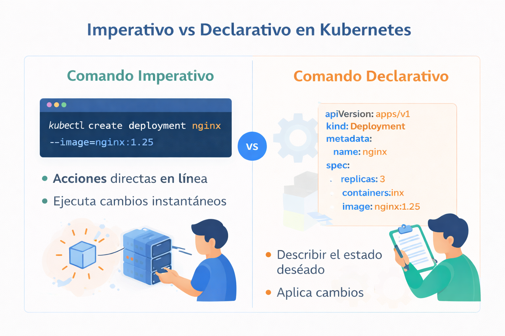

# Métodos imperativos y declarativos 

Hay dos formas principales de administrar objetos de Kubernetes: imperativo (con comandos kubectl) y declarativo (escribiendo manifiestos y luego usando kubectl apply). Cada uno tiene sus propias ventajas y desventajas, por lo que es mejor elegir un método según su caso de uso.

Los comandos imperativos son excelentes para el aprendizaje y los experimentos interactivos, pero no le brindan acceso completo a la API de Kubernetes. Los comandos declarativos son útiles para implementaciones y producción reproducibles.

A continuación veremos un ejemplo del enfoque imperativo y otro del enfoque declarativo.

- Enforque imperativo

```
kubectl run <desired-pod-name> --image <Container-Image> --generator=run-pod/v1
```

- Enfoque declavaritvo
```
apiVersion: v1
kind: Pod
metadata:
  name: <desired-pod-name>
  labels:
    app: myapp         
spec:
  containers:
    - name: myapp
      image: <Container-Image>
```

<p align="center">

</p>


## Defininición base del YAML
```
apiVersion:
kind:
metadata:
  
spec:
```

- apiVersion: Especifica la versión de la API de Kubernetes a la que se adhiere el recurso. Garantiza la compatibilidad entre el archivo YAML y el clúster de Kubernetes. Por ejemplo, “apiVersion: v1” corresponde a la API principal de Kubernetes. Además, otras versiones de API pueden ser específicas de determinadas extensiones de Kubernetes o recursos personalizados.

- kind: Define el tipo de recurso que se crea o modifica. Determina cómo Kubernetes interpreta y gestiona el recurso. Los tipos comunes incluyen “Deployment”, “Service”, “Pod”, “ConfigMap” e “Ingress”. Cada tipo tiene su propio conjunto de campos y comportamiento definidos en la API de Kubernetes.

- metadata:: El campo “metadata” contiene información esencial sobre el recurso, como “name”, “labels” y “annotations”. Ayuda a identificar y organizar recursos dentro del clúster. Los siguientes son subcampos importantes de metadatos:

  - name: Especifica el nombre del recurso, lo que permite identificarlo de forma única dentro de su espacio de nombres.
  - labels: Permite la categorización y agrupación de recursos en función de pares clave-valor. Las etiquetas se utilizan ampliamente para seleccionar recursos cuando se utilizan selectores o se aplican implementaciones.
  - annotations: Proporciona información adicional o metadatos sobre el recurso. Las anotaciones se utilizan normalmente con fines de documentación, integraciones de herramientas o para agregar metadatos personalizados.

- spec : Describe los detalles de configuración y el comportamiento del recurso. La estructura y el contenido del campo “spec” varían según el tipo de recurso. Aquí están algunos ejemplos:

  - Pod: Describe las especificaciones del contenedor, como la imagen, los puertos, las variables de entorno y los volúmenes.
  - Deployment: Incluye detalles como la cantidad de réplicas, especificaciones del contenedor (por ejemplo, imagen, puertos, variables de entorno) y montajes de volumen.
  - Service: Define las reglas de red para el servicio, incluidos los puertos expuestos, el tipo de servicio (por ejemplo, ClusterIP, NodePort, LoadBalancer) y los puertos de destino.
  - ConfigMap: Especifica los pares clave-valor o archivos de configuración que deben estar disponibles para los contenedores como variables de entorno o volúmenes montados.
