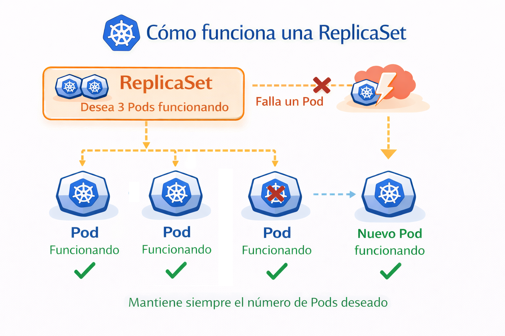
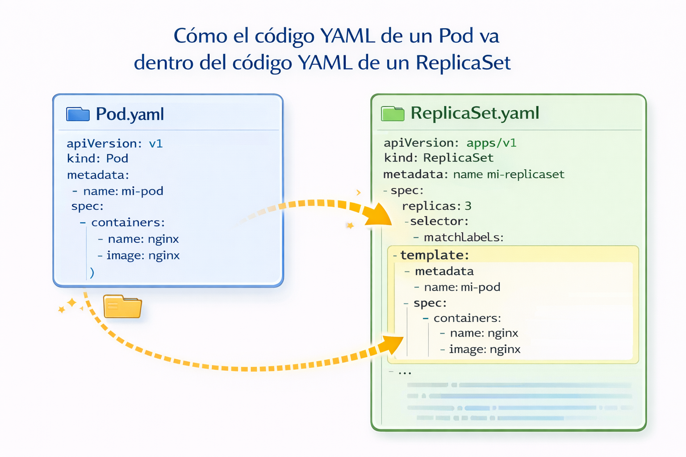

# ReplicaSet

Su propósito es mantener un conjunto estable de réplicas de Pods ejecutándose en un momento dado. A menudo se utiliza para garantizar la disponibilidad de una cantidad específica de Pods idénticos.

<p align="center">

</p>

Funcionamiento: Defines cuántos Pods quieres (ej: 3)
1. El ReplicaSet crea esos Pods
2. Si un Pod falla ❌
  → crea uno nuevo automáticamente ✅
3. Si hay más Pods de los necesarios
  → elimina los extras

<p align="center">

</p>

## Metodos declarativo

- Crear un replicaset usando un YAML

Creamos el archivo "replicaset-definition.yaml" con el siguiente contenido
  
```
apiVersion: apps/v1
kind: ReplicaSet
metadata:
  name: my-replicaset
  labels:
    app: my-replicaset
spec:
  replicas: 2
  selector: # El selector se utiliza para identificar pods para ejecutar réplicas.
    matchLabels:
      app: my-pods
  template:
    metadata:
      labels:
        app: my-pods
    spec:
      containers:
      - name: nginx-container
        image: nginx
```


```
kubectl create -f replicaset-definition.yaml
```
- Eliminamos el pod

```
kubectl delete -f replicaset-definition.yaml
```

## Metodos imperativos

- Listar las replicaSets
```
kubectl get replicaset
```

- Describir una replicaSet 
```
kubectl describe replicaset <replicaset-name>
```

- Eliminar una replicaSet
```
 kubectl delete replicaset <replicaset-name>
```
## Probamos la alta disponibilidad

- Eliminamos cualquier pod

```
kubectl delete pod <Pod-Name>
```

- Verificamos que existe la misma cantidad de pods especificados en el replicaset

```
kubectl get pods
```

## Probamos la escalabilidad

En "replicaset-definition.yaml" vamos a cambiar la siguiente linea
```
replicas: 2
```
por
```
replicas: 3
```
Para actualizar lanzamos el siguiente comando
```
kubectl apply -f replicaset-definition.yaml 
```
Verificamos la cantidad de pods
```
kubectl get pods
```
