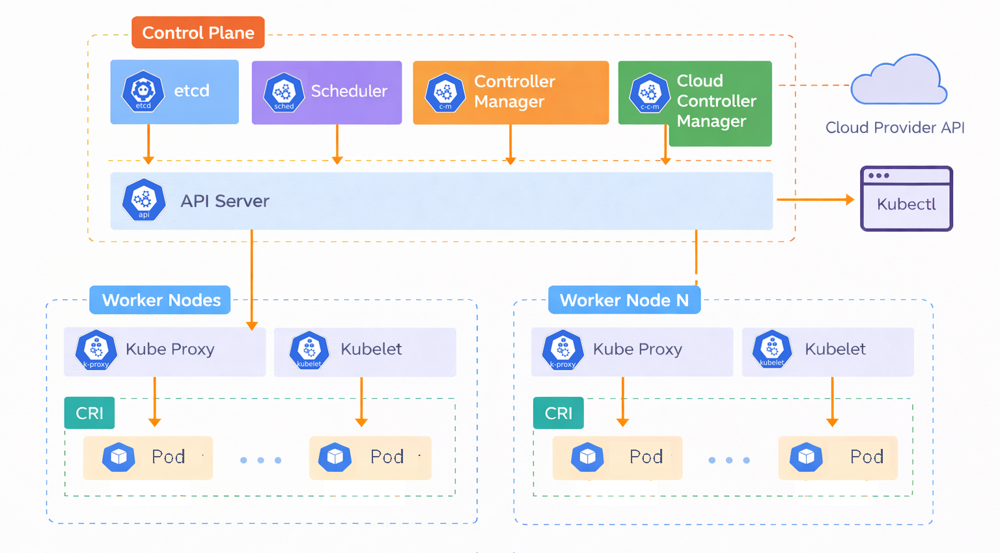
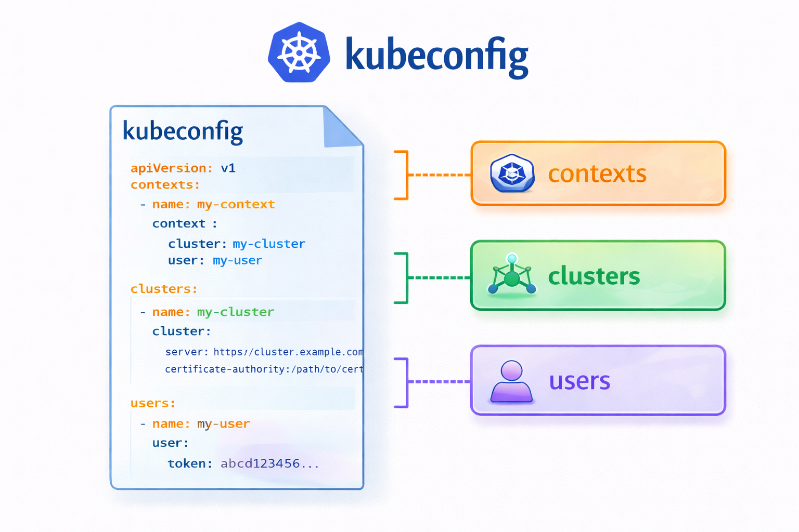

# Arquitectura de Kubernetes

La arquitectura de Kubernetes se basa en un modelo Master–Worker (actualmente llamado Control Plane – Worker Nodes).

## Control Plane (Plano de Control)

Es el cerebro del cluster de kubernetes. Toma decisiones globales, gestiona y mantiene el estado deseado del clúster. 
La redundancia del plano de control de Kubernetes (alta disponibilidad) requiere ejecutar múltiples nodos de plano de control distribuidos (normalmente 3 o 5) para eliminar puntos únicos de falla.
Posee los siguientes componentes:

### Kube API Server

+ Punto de entrada para interactuar con el clúster.
+ Todas las comunicaciones pasan por aquí.
+ Expone una API REST, soporta operaciones HTTP CRUD.
+ Los recursos están organizados en grupos de API.
  + /api/v1 – apiVersion: v1 (Core group)
  + /apis/$GROUP_NAME/$VERSION – apiVersion: apps/v1 (Named group)
+ Los recursos están organizados en grupos de API.
+ La autenticación se realiza mediante tokens, certificates, etc.
+ La autorización se realiza mediante RBAC, ABAC, etc

### etcd

+ Es una base de datos key-value distribuida.
+ Guarda el estado del clúster (pods, nodos, configuraciones, etc).
+ Altamente disponible y tolerante a fallos.
+ Ofrece funciones de autenticación y cifrado TLS.
+ Usualmente se coloca instancia de etcd en cada nodo del plano de control.
+ Tambien el etcd se puede colocar en un cluster dedicado.

### Kube Scheduler

+ Decide en qué nodo se ejecutará cada Pod.
+ Evalúa recursos disponibles (CPU, RAM, afinidad, etc.) para determinar el mejor nodo para correr un pod.
+ El proceso de scheduler de 3 pasos
  + **Filtrado (Predicados):** El scheduler filtra todos los nodos del clúster para encontrar aquellos que puedan ejecutar el pod. Comprueba la disponibilidad de recursos (CPU, memoria), los selectores de nodos, las tolerancias y las reglas de afinidad. Si no se encuentran nodos, el pod permanece sin programar.
  + **Puntuación (Prioridades):** El scheduler clasifica los nodos viables restantes según las reglas de puntuación para determinar el mejor candidato. Los factores incluyen la capacidad libre suficiente (menos solicitada) o la ubicación de la imagen.
  + **Vinculación (Selección de Nodos):** El scheduler selecciona el nodo con la puntuación más alta y envía esta información al servidor de API mediante un proceso denominado vinculación, actualizando así la especificación del pod.
+ La colocación de las puede se puede controlar mediante
  + Node name
  + Node selectors
  + Affinities
  + Taints/tolerations

### Controller Manager

+ Ejecuta varios controladores y los mantiene en un estado deseado. Observar continuamente el estado del clúster a través del kube-api-server.
+ Un controlador es un proceso que observa el estado actual del clúster y lo compara con el estado deseado, y si hay diferencias, realiza acciones para corregirlas. Este patrón se llama **control loop**.
+ El kube-controller-manager ejecuta varios controladores importantes como:
  + Node Controller: Se encarga de gestionar los nodos del clúster.
  + Replication Controller: Garantiza que siempre exista el número correcto de pods.
  + Deployment Controller: Gestiona los objetos Deployment.
  + Job Controller: Administra los Jobs.

### Cloud Controller Manager

+ Integra el plano de control de Kubernetes con la infraestructura del proveedor de nube.
+ Su función principal es permitir que Kubernetes interactúe con recursos externos del cloud, como:
  + Balanceadores de carga
  + IPs públicas
  + Instancias/VMs
  + Rutas de red
+ Esto hace que Kubernetes pueda funcionar correctamente en proveedores como: Amazon Web Services, Google Cloud, Microsoft Azure.

## Data Plane o Worker Nodes (Nodos de Trabajo)

Son las máquinas donde se ejecutan los contenedores. Posee los siguientes componentes:

### Kubelet

+ Es un agente que vive en cada nodo, tanto en worker nodes como en el control plane.
+ Recibe la definición de los pods del API Server.
+ Maneja la asignación de recursos a los pods (CPU, memoria y almacenamiento)
+ Supervisa el estado del nodo y de los contenedores
+ Garantiza que los pods se instancian, se ejecutan y finalizan en un nodo.

### Kube Proxy

+ vive en cada worker node
+ Maneja la red y balanceo interno.
+ Permite comunicación entre Pods y Servicios.
+ Aplica políticas de red para controlar el tráfico entre pods y servicios
+ Facilita el descubrimiento de servicios

### Container Runtime Interface

+ El Container Runtime ejecuta contenedores dentro de pods.
+ Kubernetes admite cualquier entorno de ejecución de contenedor que implemente CRI.
+ Ejemplo: containerd, CRI-O, Kata Containers, Firecracker.

## Kubeconfig

+ El kubeconfig es el archivo que usa el cliente de Kubernetes para saber cómo conectarse a un clúster.
+ Por defecto está en: **~/.kube/config** o puedes definir la ruta con la variable de entorno **KUBECONFIG**
+ Un kubeconfig tiene tres bloques principales:
  + Clusters: (Endpoint del cluster, información de CA del servidor)
  + Users: Credenciales de autenticación de usuarios (tokens, certs)
  + Contexts: Define la configuración de acceso al clúster ( cluster, user, namespace, otras configuraciones)

## Kubernetes Resources

+ Son objetos del API que representan el estado del clúster (Pod, Service, Deployment, Jobs, etc.)
+ Se definen pueden definir:
  + Mediante JSON o YAML (Declarativo)
  + Mediante comandos CLI (Imperativo)
+ Se almacenan en etcd
+ Los recursos se encuentran organizados por namesapces
+ Para listar todos los recursos disponibles en el API: **kubectl api-resources**
