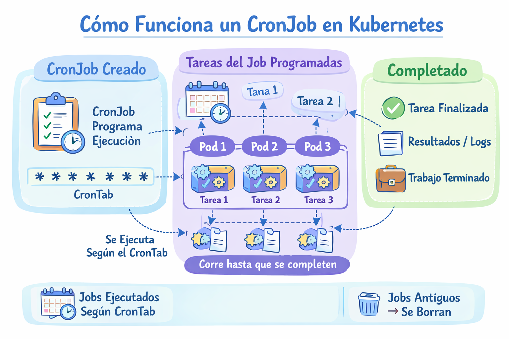

# CronJob

Un CronJob  es un recurso que permite ejecutar tareas automáticas en horarios programados, similar al comando cron en Linux.

<p align="center">

</p>

## Metodo declarativo

- Crear un CronJob usando un YAML

Creamos el archivo "cronjob-definition.yaml" con el siguiente contenido

```
apiVersion: batch/v1
kind: CronJob
metadata:
  name: my-cronjob
spec:
  schedule: "* * * * *"
  jobTemplate:
    spec:
      template:
        spec:
          containers:
          - name: busybox-container
            image: busybox
            command: ["echo", "Hola Kubernetes"]
          restartPolicy: Never
```
```
kubectl create -f job-definition.yaml
```
- Eliminamos el deployment

```
kubectl delete -f job-definition.yaml
```

## Metodos imperativos

- Crear un Job
```
kubectl create cronjob <CronJob-Name> --image=<Container-Image> --schedule="CRON" -- COMANDO
```
Ejemplo
```
kubectl create cronjob test-cron --image=busybox  --schedule="* * * * *" -- echo "Hola desde Kubernetes"
```

- Listar Jobs
```
kubectl get cronjob
```

- Describir un Job
```
kubectl describe cronjob <cronjob-name>
```  

- Eliminar un Job
```
kubectl delete cronjob <cronjob-name>
```
