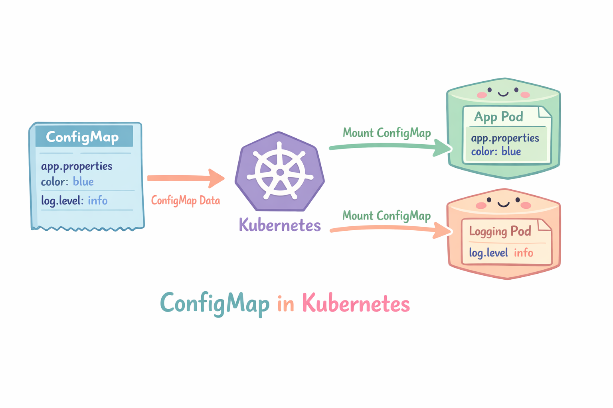

# ConfigMaps

Un ConfigMap es un objeto que se usa para almacenar configuración de aplicaciones en forma de pares clave-valor y poder inyectarla en los Pods.

Permite guardar cosas como:
- Variables de entorno
- Archivos de configuración
- Parámetros de la aplicación
- URLs de servicios

<p align="center">

</p>

## Metodo declarativo

- Crear un ConfigMap usando un YAML

Creamos el archivo "configmap-definition.yaml" con el siguiente contenido

```
apiVersion: v1
kind: ConfigMap
metadata:
  name: app-config
data:
  APP_MODE: production
  APP_PORT: "8080"
```
```
kubectl create -f configmap-definition.yaml
```
- Eliminamos el deployment

```
kubectl delete -f configmap-definition.yaml
```


## Metodos imperativos

- Crear un ConfigMap
```
kubectl create configmap <ConfigMap-Name> --from-literal=<KEY>=<VALUE>

```
Ejemplo
```
kubectl create configmap app-config --from-literal=APP_MODE=production --from-literal=APP_PORT=8080
```

- Listar ConfigMap
```
kubectl get configmap
```

- Describir un ConfigMap
```
kubectl describe configmap <configmap-name>
```  

- Eliminar un ConfigMap
```
kubectl delete configmap <configmap-name>
```

## Ejemplo: ConfigMap en un pod 

- Creamos el ConfigMap

```
apiVersion: v1
kind: ConfigMap
metadata:
  name: app-config
data:
  APP_MODE: production
  APP_PORT: "8080"
```

- Montamos el ConfigMap en el pod

```
apiVersion: v1
kind: Pod
metadata:
  name: app
spec:
  containers:
  - name: app
    image: nginx
    envFrom:
    - configMapRef:
        name: app-config
```

- Tambien podriamos montar cada valor por separado

```
apiVersion: v1
kind: Pod
metadata:
  name: app
spec:
  containers:
  - name: app
    image: nginx
    env:
    - name: APP_MODE
      valueFrom:
        configMapKeyRef:
          name: app-config
          key: APP_MODE

    - name: APP_PORT
      valueFrom:
        configMapKeyRef:
          name: app-config
          key: APP_PORT
```
