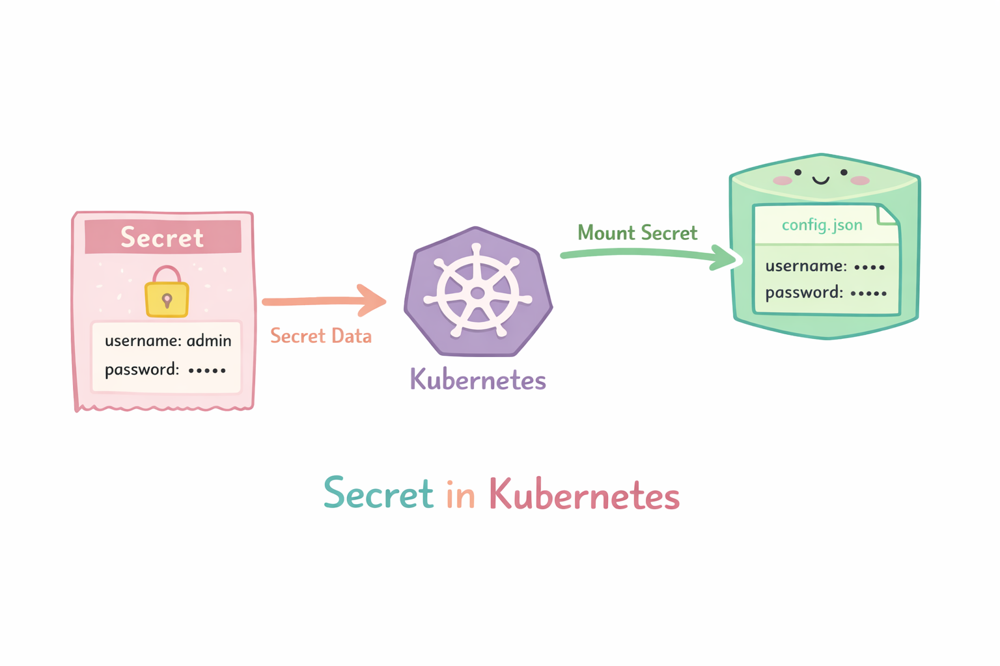

# Secrets
un Secret es un objeto que se utiliza para almacenar información sensible y pasarla de forma segura a los Pods.

Sirve para guardar datos como:

- contraseñas
- tokens
- claves API
- certificados TLS
- credenciales de bases de datos

<p align="center">

</p>

## Metodo declarativo

- Crear un Secret usando un YAML

Creamos el archivo "secret-definition.yaml" con el siguiente contenido

```
apiVersion: v1
kind: Secret
metadata:
  name: db-secret
type: Opaque
data:
  username: YWRtaW4=
  password: MTIzNDU2
```
```
kubectl create -f secret-definition.yaml
```
- Eliminamos el deployment

```
kubectl delete -f secret-definition.yaml
```

## Metodos imperativos

- Crear un Secret
```
kubectl create secret generic <Secret-Name> --from-literal=<KEY>=<VALUE>

```
Ejemplo
```
kubectl create secret generic db-secret --from-literal=username=admin --from-literal=password=123456
```

- Listar Secrets
```
kubectl get secret
```

- Describir un Secret
```
kubectl describe secret <secret-name>
```  

- Eliminar un Secret
```
kubectl delete secret <secret-name>
```

## Ejemplo: Secret en un pod 

Vamos a crear el secret

secret-password.yaml
```
apiVersion: v1
kind: Secret
metadata:
  name: pg-secrets
type: Opaque
data:
  db-password: bWF4Y2xvdWRwYXNz   # El valor esta en base64, para verlo  echo -n 'maxcloudpass' | base64
```

```
kubectl create -f secret-password.yaml
```

postgres-deployment.yaml
```
apiVersion: apps/v1
kind: Deployment
metadata:
  name: my-deployment
  labels:
      app: my-deployment
spec:
  replicas: 1
  selector:
    matchLabels:
      app: my-postgres
  template: 
    metadata:
      labels: 
        app: my-postgres      
    spec:
      containers:
        - name: postgres-container
          image: postgres
          ports:
            - containerPort: 5432
          env:
            - name: POSTGRES_PASSWORD
              valueFrom:
                secretKeyRef:
                  name: pg-secrets
                  key: db-password
            - name: PGDATA
              value: /var/lib/postgresql/data/pgdata
```

```
kubectl create -f postgres-deployment.yaml
```
