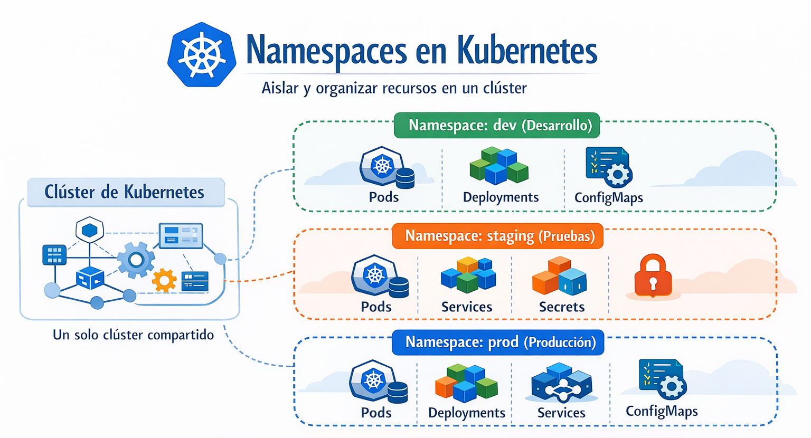

# Namespace

Proporciona un mecanismo para aislar grupos de recursos dentro de un solo clúster. Los nombres de los recursos deben ser únicos dentro de un espacio de nombres, pero no entre espacios de nombres.

Ejemplo sencillo

- Imagina que tienes un clúster para toda tu empresa:

  - dev → entorno de desarrollo
  - staging → pruebas
  - prod → producción

  Cada uno sería un namespace distinto, y los recursos dentro de uno no interfieren con los otros.

<p align="center">

</p>

## Metodos declarativos

- Crear un namespace usando un YAML

Creamos el archivo "namespace-definition.yaml" con el siguiente contenido

```
apiVersion: v1
kind: Namespace
metadata:
  name: <namespace-name>
```
```
kubectl create -f namespace-definition.yaml
```

- Eliminamos el namespace
```
kubectl delete -f namespace-definition.yaml
```

## Metodos imperativos

- Listar los namespaces

```
kubectl get namespaces
```

- Crear un namespace

```
kubectl create namespace development
```

- Lanzar un pod en el namespace development

```
kubectl run my-first-pod --image=nginx -n development
```

- Listar pods en el namespace development

```
kubectl get pods -n development
```

- Listar pods a travéz de todos los namespaces

```
kubectl get pods --all-namespaces
```

- Eliminar un pod en el namespace development

```
kubectl delete pod <POD-NAME> -n development
```

- Eliminar un namespace
```
kubectl delete namespaces development
```
