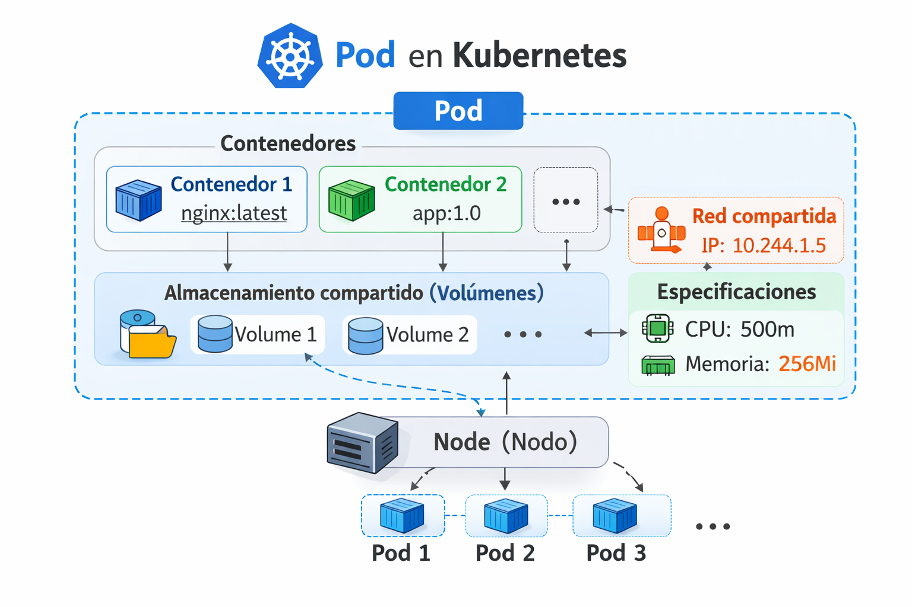

# POD

Un Pod en Kubernetes es la unidad más pequeña y básica que puedes desplegar en un clúster. Es el “bloque fundamental” sobre el que Kubernetes trabaja.

Escalar significa crear más Pods, no más contenedores dentro del mismo Pod

Un Pod es un contenedor (o grupo de contenedores) que:

- Se ejecutan juntos
- Comparten red
- Tienen almacenamiento efimero o persistente (volúmenes)
- Se comportan como una sola unidad

<p align="center">

</p>

##  Metodos declarativo

- Crear un pod usando un YAML

Creamos el archivo "pod-definition.yaml" con el siguiente contenido

```
apiVersion: v1
kind: Pod
metadata:
  name: my-pod
  labels: 
    app: my-pod-label
spec:
  containers:
    - name: nginx-container
      image: nginx
      ports:
        - containerPort: 80
```

```
kubectl create -f pod-definition.yaml
```
- Eliminamos el pod

```
kubectl delete -f pod-definition.yaml
```
  
##  Metodos imperativos

- Crear un pod
```
kubectl run <desired-pod-name> --image <Container-Image>
```
Ejemplo:
```
kubectl run my-first-pod --image=nginx
```

- Listar pods
```
kubectl get pods
```
- Listar pods con información de los nodos
```
kubectl get pods -o wide
```

- Describir un pod
```
kubectl describe pod <Pod-Name>
```
- Eliminar un pod

```
kubectl delete pod <Pod-Name>
```
- Ver los logs del pod
```
kubectl logs <pod-name>
```
- Ver los logs del pod en vivo
```
kubectl logs -f <pod-name>
```
- Conectarse a un pod y ejecutar comandos
```
kubectl exec -it <pod-name> /bin/bash
kubectl exec -it <pod-name> env
kubectl exec -it <pod-name> ls
kubectl exec -it <pod-name> cat /usr/share/nginx/html/index.html
```

```
kubectl get pod <pod-name> -o yaml   
```

# Politica de reinicio

+ Kubelet está diseñado para reiniciar los contenedores en estado **exited**.
+ restartPolicy:
  + Always
  + OnFailure
  + Never
+ La política por defecto es "Always"

```yaml
spec:
  restartPolicy: OnFailure
```

# Command & Args

En Kubernetes:

- **command** equivale al ENTRYPOINT de Docker.
- **args** equivale al CMD de Docker.

```
apiVersion: v1
kind: Pod
metadata:
  name: cmd-args-demo
spec:
  containers:
  - name: busybox
    image: busybox
    command: ["sh", "-c"]
    args:
      - |
        while true; do
          echo "Hola desde Kubernetes";
          sleep 5;
        done
```
