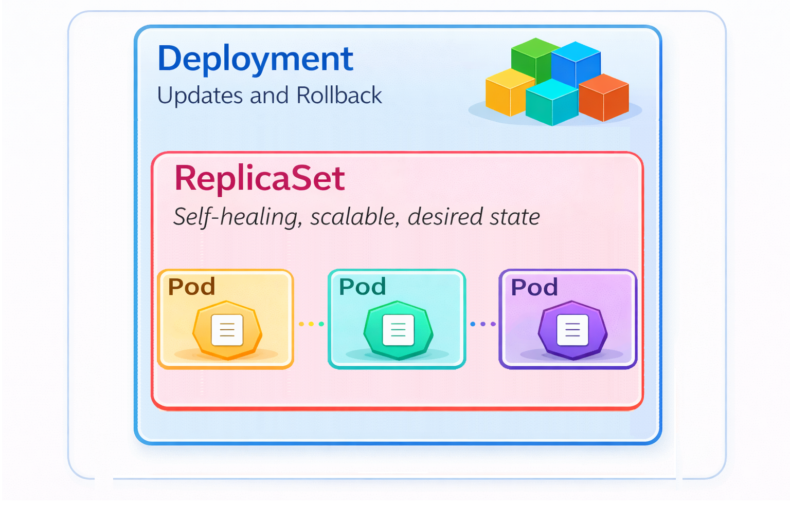
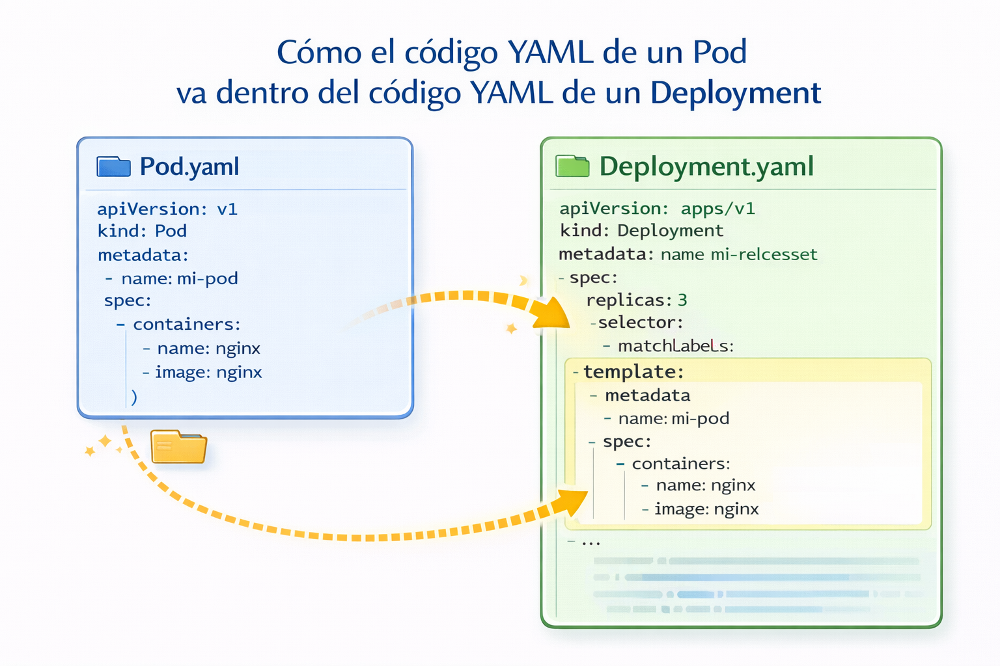
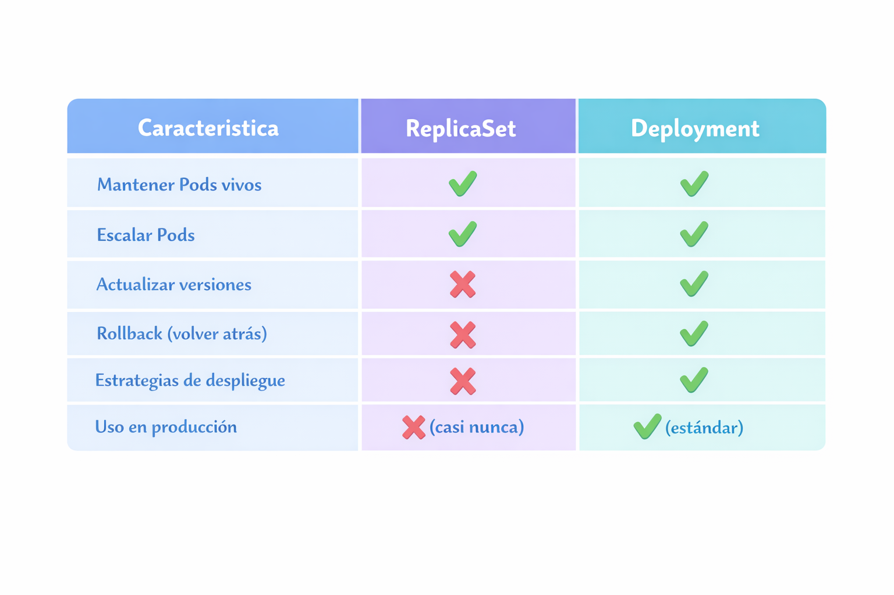

# Deployment

Un Deployment proporciona actualizaciones declarativas para Pods y ReplicaSets. Puedes definir Deployments para crear nuevos ReplicaSets o eliminar Deployments existentes y adoptar todos sus recursos con Deployments nuevos.

<p align="center">

</p>

Funcionamiento: El flujo es así:
1. Creas un Deployment
2. El Deployment crea un ReplicaSet
3. El ReplicaSet crea y mantiene los Pods

Tu describes un estado deseado en un Deployment y el controlador del Deployment cambia el estado actual al estado deseado.

<p align="center">

</p>

## Replicaset vs Deployment

<p align="center">

</p>

## Metodo declarativo

- Crear un deployment usando un YAML

Creamos el archivo "deployment-definition.yaml" con el siguiente contenido

```
apiVersion: apps/v1
kind: Deployment
metadata:
  name: my-deployment
  labels:
      app: my-deployment
spec:
  replicas: 2
  selector:
    matchLabels:
      app: my-pod
  template: 
    metadata:
      labels: 
        app: my-pod         
    spec:
      containers:
        - name: nginx-container
          image: nginx
          ports:
            - containerPort: 80
```
```
kubectl create -f deployment-definition.yaml
```
- Eliminamos el deployment

```
kubectl delete -f deployment-definition.yaml
```

## Metodos imperativos

- Crear un deployment
```
kubectl create deployment <Deplyment-Name> --image=<Container-Image>
```
Ejemplo
```
kubectl create deployment my-first-deployment --image=nginx
```

- Listar Deployments
```
kubectl get deployments
```

- Describir un Deployment
```
kubectl describe deployment <deployment-name>
```  
- Ver el replicaset
```
kubectl get replicaset
```
- Ver pods
```
kubectl get pods
```

- Eliminar un Deployment
```
kubectl delete deployment <deployment-name>
```
- Escalando el deployment
```
kubectl scale --replicas=2 deployment <Deployment-Name>
```

## Estrategias de actualizacion

+ **RollingUpdate:** Consiste en reemplazar los pods gradualmente, manteniendo la aplicación disponible.
  + maxUnavailable: Número máximo de Pods que pueden estar no disponibles durante la actualización.
  + maxSurge: Número máximo de Pods extra que pueden crearse temporalmente.

```yaml
spec:
  strategy:
    type: RollingUpdate
    rollingUpdate:
      maxUnavailable: 1
      maxSurge: 1
```

+ **Recreate:** Esta estrategia elimina todos los pods antiguos antes de crear los nuevos.

```yaml
spec:
  strategy:
    type: Recreate
``` 

## Multiple containers

Cuando trabajas con kubernetes normalmente se coloca un contenedor en un Pod, este contenedor es la aplicacion principal, pero existen casos de uso donde se podrian colocar mas de un contenedor. Mas adelante se explicaran los init containers y los sidecards containers.

```
apiVersion: apps/v1
kind: Deployment
metadata:
  name: my-deployment
  labels:
      app: my-deployment
spec:
  replicas: 1
  selector:
    matchLabels:
      app: my-pod
  template: 
    metadata:
      labels: 
        app: my-pod         
    spec:
      containers:
        - name: nginx-container
          image: nginx
          ports:
            - containerPort: 80

        - name: redis-db
          image: redis
          ports:
            - containerPort: 6379

```

En el deployment podemos ver que dos contenedores han sido desplegados en un mismo pod. No es un caso de uso comun, pero esto podria darse si queremos que dos aplicaciones escalen juntas y que haya comunicacion entre estas. El contenedor nginx-container puede conectarse al contenedor redis-db mediante localhost, usando 127.0.0.1:6379. Esto permitira que cada nginx-container tenga su propia base de datos en memoria en redis.

## Init and sidecar containers

Un Pod puede tener múltiples contenedores ejecutando aplicaciones dentro de él, pero también puede tener uno o más contenedores de inicialización que se ejecutan antes de que se inicien los contenedores de aplicación.

### Init container

Los contenedores de inicialización son exactamente iguales a los contenedores regulares excepto por:

- Los contenedores de inicialización siempre se ejecutan hasta su finalización.
- Cada contenedor de inicialiación debe completarse correctamente antes de que comience los contenedores fuera del bloque init container.

### Sidecar container

- Se ejecuta junto con el contenedor de la aplicación principal ignora la política de reinicio a nivel de pod
- Para proporcionar funciones adicionales de registro, monitorización o proxy para la aplicación principal.
- Ejemplo: Prometheus como complemento para recopilar métricas.

A continuacion mostramos un ejemplo:

```
apiVersion: apps/v1
kind: Deployment
metadata:
  name: deployment-init
  labels:
      app: deployment-init
spec:
  replicas: 1
  selector:
    matchLabels:
      app: my-pod
  template: 
    metadata:
      labels: 
        app: my-pod         
    spec:
      containers:
      - name: nginx
        image: nginx
        ports:
        - containerPort: 80
        volumeMounts:
        - name: workdir
          mountPath: /usr/share/nginx/html
        - name: logs
          mountPath: /var/log/nginx
      # These containers are run during pod initialization
      initContainers:
      - name: install # Init container
        image: busybox:1.28
        command: ["wget","-O","/work-dir/index.html","https://checkip.amazonaws.com"]
        volumeMounts:
        - name: workdir
          mountPath: "/work-dir"
      - name: logshipper # Sidecar container
        image: busybox
        restartPolicy: Always
        command: ['sh', '-c', 'tail -F /logs/access.log']
        volumeMounts:
        - name: logs
          mountPath: /logs
      volumes:
      - name: workdir
      - name: logs
        emptyDir: {}
```

```
kubectl apply -f deployment-init.yaml 
```
Vamos a acceder a un pod con el siguiente comando

```
kubectl exec -it my-deployment-XXXXXXXXXX-XXXXX bash
```

Una vez dentro del container vamos a imprimir el contenido de index.html que se genero en el initContainer y deberiamos ver la IP publica de la instancia que contiene al pod
