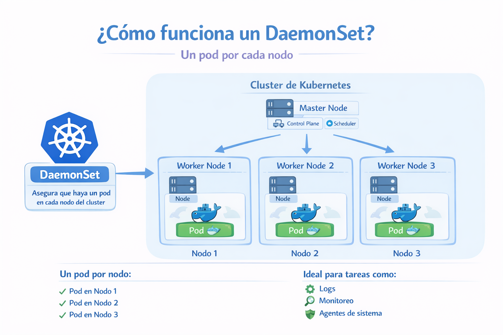

# DaemonSet

Un DaemonSet garantiza que todos (o algunos) los nodos ejecuten una copia de un pod. A medida que se añaden nodos al clúster, se añaden pods. A medida que se eliminan nodos del clúster, esos pods se reciclan. Eliminar un DaemonSet eliminará los pods que creó.

<p align="center">

</p>

Algunos usos típicos de un DaemonSet son:

- Ejecutar un demonio de almacenamiento de clúster en cada nodo.
- Ejecutar un demonio de recopilación de registros en cada nodo.
- Ejecutar un demonio de monitorización de nodos en cada nodo.


Creamos el archivo "daemonset-definition.yaml" con el siguiente contenido
```
apiVersion: apps/v1
kind: DaemonSet
metadata:
  name: fluentd
spec:
  selector:
    matchLabels:
      name: fluentd
  template:
    metadata:
      labels:
        name: fluentd
    spec:
      containers:
        - name: fluentd-elasticsearch
          image: quay.io/fluentd_elasticsearch/fluentd:latest
```
```
kubectl create -f daemonset-definition.yaml
```
