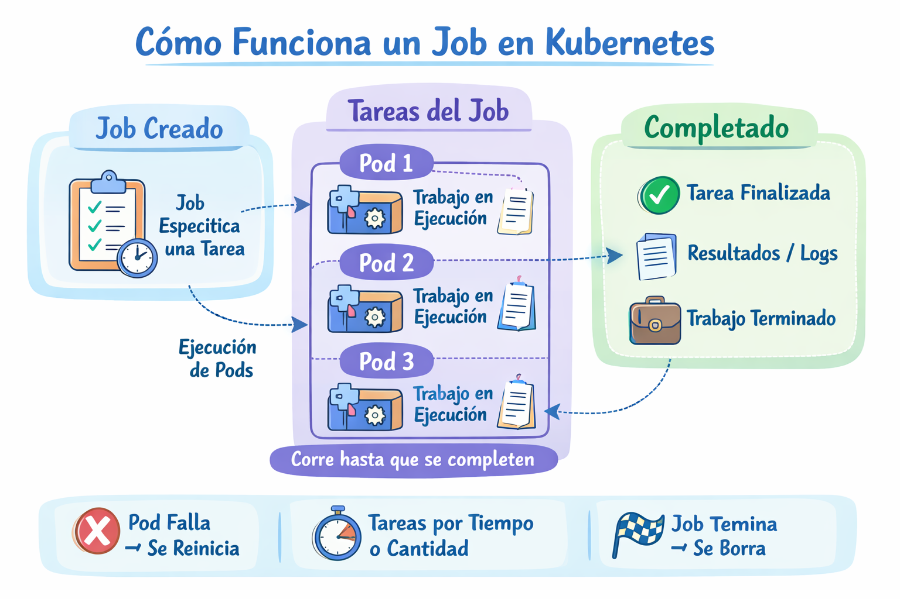

# Job

Un Job es un recurso que ejecuta una tarea hasta que se complete exitosamente.

<p align="center">

</p>

## Metodo declarativo

- Crear un Job usando un YAML

Creamos el archivo "job-definition.yaml" con el siguiente contenido

```
apiVersion: batch/v1
kind: Job
metadata:
  name: my-job
spec:
  template:
    spec:
      containers:
      - name: busybox-container
        image: busybox
        command: ["echo", "Hola Kubernetes"]
      restartPolicy: Never
```
```
kubectl create -f job-definition.yaml
```
- Eliminamos el deployment

```
kubectl delete -f job-definition.yaml
```

## Metodos imperativos

- Crear un Job
```
kubectl create job <Job-Name> --image=<Container-Image> -- comando
```
Ejemplo
```
kubectl create job my-job --image=busybox -- echo "Hola Kubernetes"
```

- Listar Jobs
```
kubectl get jobs
```

- Describir un Job
```
kubectl describe job <job-name>
```  

- Eliminar un Job
```
kubectl delete job <job-name>
```

## Opciones

- Para volver a ejecutar el Pod automáticamente hasta que tenga éxito.

```yaml
backoffLimit: 4
```
- Un Job también puede ejecutar múltiples pods simultáneamente.

```yaml
parallelism: 3
completions: 10
```
Esto significa:
+ se ejecutan 3 pods al mismo tiempo
+ hasta completar 10 ejecuciones exitosas.
