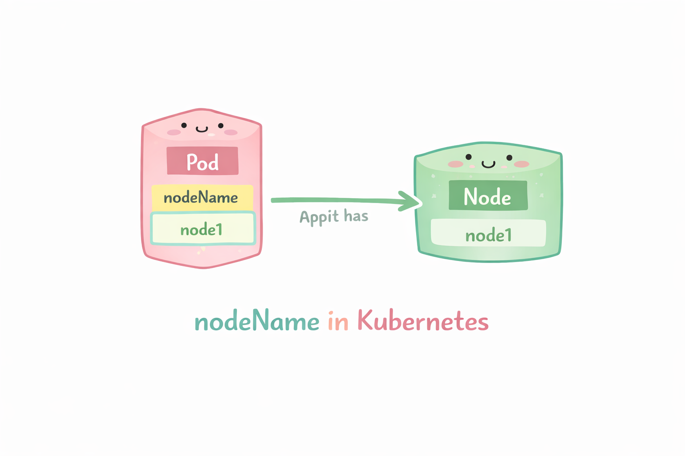
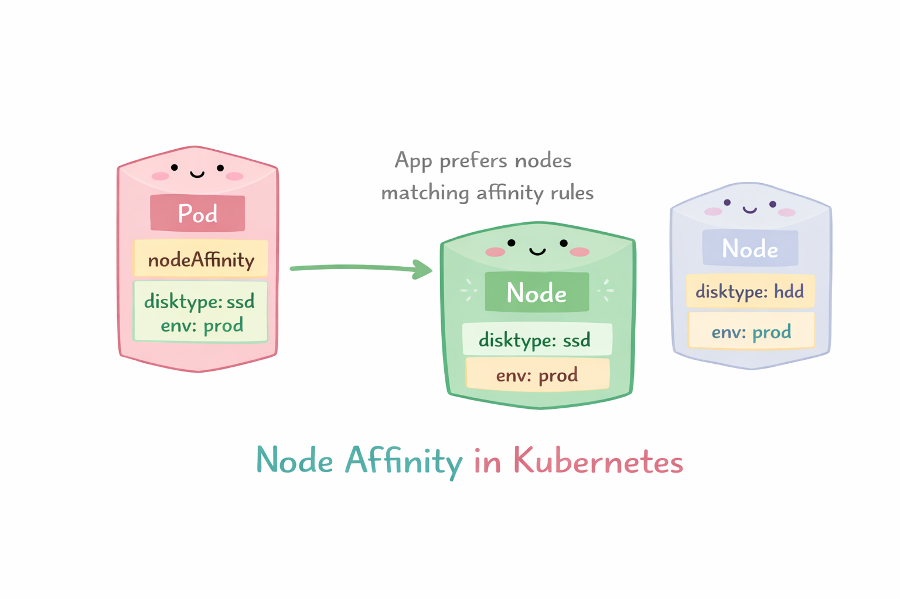

# Scheduling

Es el proceso mediante el cual Kubernetes decide qué nodo (worker node) es el mejor para ejecutar un Pod dentro del cluster.

El proceso de scheduler tiene 3 pasos
+ **Filtrado (Predicados):** El scheduler filtra todos los nodos del clúster para encontrar aquellos que puedan ejecutar el pod. Comprueba la disponibilidad de recursos (CPU, memoria), los selectores de nodos, las tolerancias y las reglas de afinidad. Si no se encuentran nodos, el pod permanece sin programar.
+ **Puntuación (Prioridades):** El scheduler clasifica los nodos viables restantes según las reglas de puntuación para determinar el mejor candidato. Los factores incluyen la capacidad libre suficiente (menos solicitada) o la ubicación de la imagen.
+ **Vinculación (Selección de Nodos):** El scheduler selecciona el nodo con la puntuación más alta y envía esta información al servidor de API mediante un proceso denominado vinculación, actualizando así la especificación del pod.

En resumen el kube-scheduler:

1. Detecta Pods que no tienen nodo asignado
2. Evalua los nodos disponibles
3. Elege el mejor nodo posible
4. Asigna el Pod a ese nodo

La ubicación de los pods se puede controlar mediante el nodeName, los selectors de nodo, las affinities y taints/tolerations.

## Resource & Limits

En Kubernetes, los resources (requests y limits) en un Pod sirven para controlar cuánto CPU y memoria usa cada contenedor y cómo el scheduler decide dónde ejecutarlo.

Ejemplo: Dentro de un contenedor en un pod puedes definir:

```yaml
resources:
  requests:
    cpu: "500m"
    memory: "256Mi"
  limits:
    cpu: "1"
    memory: "512Mi"
```

Esto tiene dos partes importantes:

**requests → lo que el pod necesita**
- Es lo mínimo garantizado
- Kubernetes usa esto para decidir en qué nodo colocar el pod (scheduler)
- El nodo debe tener al menos esos recursos disponibles

**limits → lo máximo permitido**
- Define el tope que el contenedor puede usar.

```yaml
apiVersion: v1
kind: Pod
metadata:
  name: nginx-resources
spec:
  containers:
  - name: nginx
    image: nginx:latest
    resources:
      requests:
        cpu: "100m"
        memory: "128Mi"
      limits:
        cpu: "500m"
        memory: "256Mi"
```

## NodeName

Puedes especificar el nodeName en el spec del pod. Esto hara que el pod se coloque en el nodo con ese nombre.

<p align="center">

</p>

```yaml
apiVersion: v1
kind: Pod
metadata:
  name: pod-en-nodo-especifico
spec:
  nodeName: node1   # Nombre exacto del nodo
  containers:
  - name: nginx
    image: nginx:latest
    ports:
    - containerPort: 80
```
## NodeSelector

Puedes especificar el nodeSelector en el spec del pod. Esto hara que el pod se coloque en cualquier nodo con esa etiqueta.

<p align="center">

</p>

```yaml
apiVersion: v1
kind: Pod
metadata:
  name: pod-con-nodeselector
spec:
  nodeSelector:
    kubernetes.io/hostname: controlplane   # Etiqueta del nodo
  containers:
  - name: nginx
    image: nginx:latest
    ports:
    - containerPort: 80
```

## Node Affinity y Anti-affinity

De forma similar a nodeSelector, proporciona un mayor control en la selección de nodos utilizando operadores lógicos para seleccionarlos.

### Node Affinity

Garantiza que los pods se programen en nodos con etiquetas específicas.

<p align="center">

</p>

Ejemplo:

```yaml
apiVersion: v1
kind: Pod
metadata:
  name: pod-con-node-affinity
spec:
  affinity:
    nodeAffinity:
      requiredDuringSchedulingIgnoredDuringExecution:
        nodeSelectorTerms:
        - matchExpressions:
          - key: kubernetes.io/hostname
            operator: In
            values:
            - controlplane
      preferredDuringSchedulingIgnoredDuringExecution:
      - weight: 1
        preference:
          matchExpressions:
          - key: kubernetes.io/arch
            operator: In
            values:
            - amd64
  containers:
  - name: nginx
    image: nginx:latest
    ports:
    - containerPort: 80
```

- Utilice operadores como In, Exists, Gt, Lt
- Regla obligatoria (required...)
  - El Pod solo se programará en nodos que tengan: disktype=ssd
- Regla preferida (preferred...)
  - Kubernetes intentará usar nodos que tengan: env=prod, pero no es obligatorio
  
### Node Anti-affinity

Garantiza que los pods no se programen en nodos con etiquetas específicas.

<p align="center">

</p>

```yaml
apiVersion: v1
kind: Pod
metadata:
  name: pod-con-node-anti-affinity
spec:
  affinity:
    nodeAffinity:
      requiredDuringSchedulingIgnoredDuringExecution:
        nodeSelectorTerms:
        - matchExpressions:
          - key: kubernetes.io/hostname
            operator: NotIn
            values:
            - controlplane
      preferredDuringSchedulingIgnoredDuringExecution:
      - weight: 1
        preference:
          matchExpressions:
          - key: kubernetes.io/arch
            operator: NotIn
            values:
            - arm64
  containers:
  - name: nginx
    image: nginx:latest
    ports:
    - containerPort: 80
```

- Utilice operadores como NotIn, DoesNotExist, Gt, Lt
- Regla obligatoria (required...)
  - El Pod NO se programará en nodos con:: disktype=ssd
- Regla preferida (preferred...)
  - Kubernetes evitara nodos que tengan: env=prod, pero no es obligatorio
  
### Taints y tolerations

Los taints y tolerations en Kubernetes son un mecanismo para controlar qué Pods NO pueden ejecutarse en ciertos nodos, a menos que explícitamente lo permitan.

A diferencia de nodeSelector (que atrae Pods), esto funciona como un filtro de exclusión.

- Taint (en el nodo) -> NO quiero Pods aquí
- Toleration (en el Pod) -> yo sí puedo entrar

<p align="center">

</p>

Ejemplo:

kubectl taint nodes node-name key=value:NoSchedule

```sh
kubectl taint nodes node01 workload=batch:NoSchedule
```

- key=value → etiqueta del taint
- effect → comportamiento

```yaml
apiVersion: v1
kind: Pod
metadata:
  name: pod-con-toleration
spec:
  tolerations:
  - key: "workload"
    operator: "Equal"
    value: "batch"
    effect: "NoSchedule"
  containers:
  - name: nginx
    image: nginx:latest
```

#### Tipos de efectos

- NoSchedule: No se programan nuevos Pods (los existentes siguen)
- NoExecute: Expulsa Pods que no toleren el taint
- PreferNoSchedule: Kubernetes intenta evitar ese nodo (no obligatorio)

Ejemplo real:

kubectl taint nodes nodo1 workload=ml:NoSchedule

```yaml
tolerations:
- key: "workload"
  value: "ml"
  effect: "NoSchedule"
```

Resultado:
- Pods normales ❌
- Pods ML ✅

### Pod Disruption Budget (PDB)

Un Pod Disruption Budget (PDB) en Kubernetes es un mecanismo que limita cuántos pods de una aplicación pueden estar inactivos al mismo tiempo durante interrupciones controladas.

Protege la disponibilidad de tu aplicación cuando ocurren interrupciones voluntarias, como:

- Actualizaciones de nodos (drain)
- Mantenimiento del clúster
- Escalado de nodos
- Deployments o rollouts

**Importante:** NO protege contra caídas inesperadas (por ejemplo, si un nodo se apaga de golpe).

Tienes dos formas de configurarlo:

#### 1 minAvailable

Cantidad mínima de pods que deben estar activos.

```yaml
apiVersion: policy/v1
kind: PodDisruptionBudget
metadata:
  name: mi-app-pdb
spec:
  minAvailable: 2
  selector:
    matchLabels:
      app: mi-app
```

Esto significa: De todos los pods con label app=mi-app, al menos 2 deben estar siempre disponibles

#### 2 maxUnavailable

Cantidad máxima de pods que pueden estar inactivos.

```yaml
apiVersion: policy/v1
kind: PodDisruptionBudget
metadata:
  name: mi-app-pdb
spec:
  maxUnavailable: 1
  selector:
    matchLabels:
      app: mi-app
```

Esto significa: De todos los pods con label app=mi-app, solo 1 puede estar inactivo.
