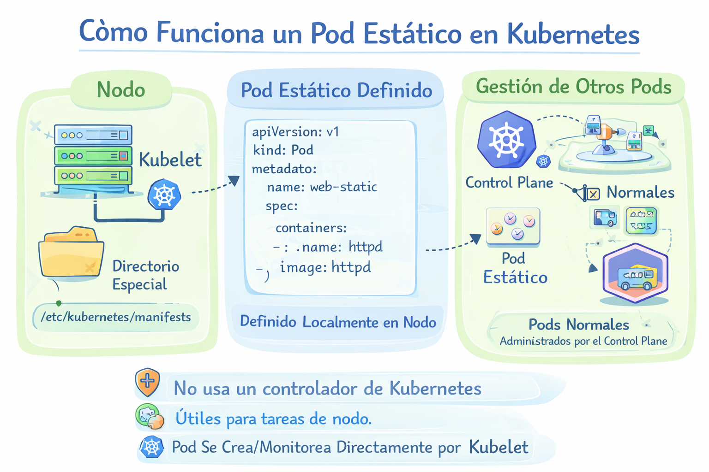

# Pod statico

Un Static Pod (Pod estático) es un Pod que se ejecuta directamente por el kubelet en un nodo, sin ser gestionado por el API Server.

Es creado directamente en el nodo a partir de un archivo YAML local. Adecuado para tareas livianas y específicas del nodo.

El kubelet monitorea una carpeta en el nodo y crea automáticamente los Pods definidos ahí. Normalmente en la ruta: /etc/kubernetes/manifests/

Carecen de funciones como escalabilidad, actualizaciones continuas u opciones de programación avanzadas.

<p align="center">

</p>

Por ejemplo el archivo nginx.yaml

```
apiVersion: v1
kind: Pod
metadata:
  name: nginx-static
spec:
  containers:
  - name: nginx
    image: nginx
```

Ubicando en: /etc/kubernetes/manifests/nginx.yaml
