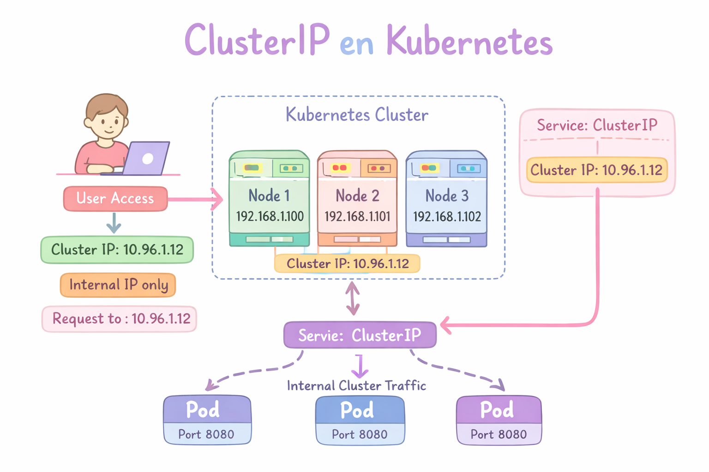
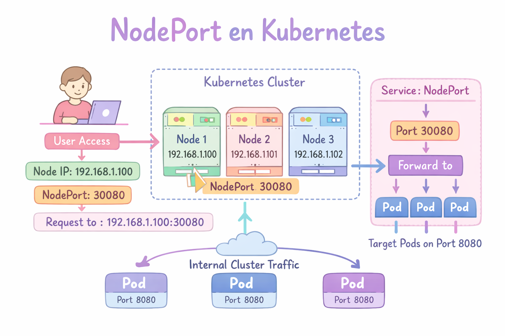
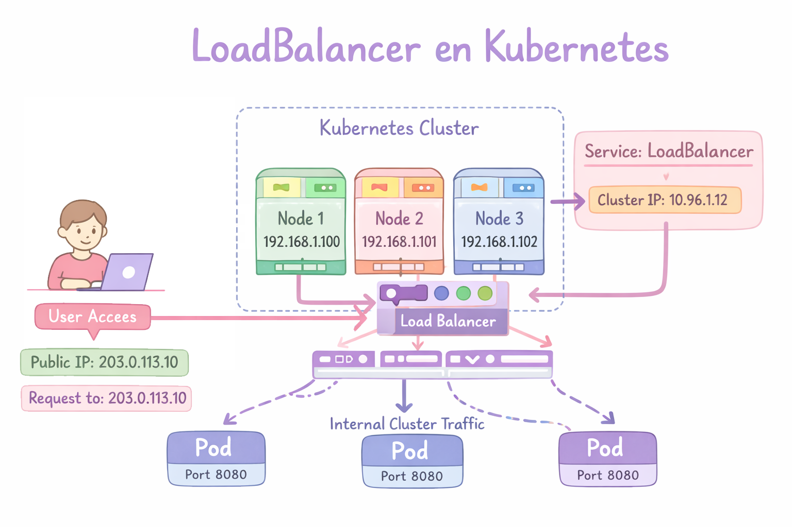
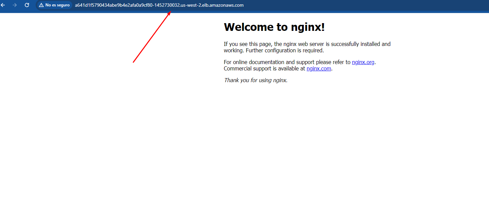
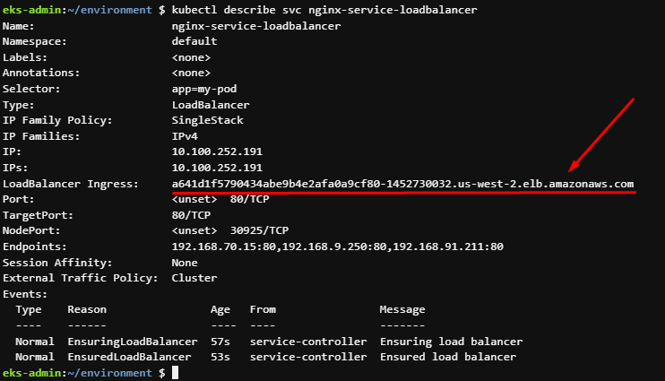
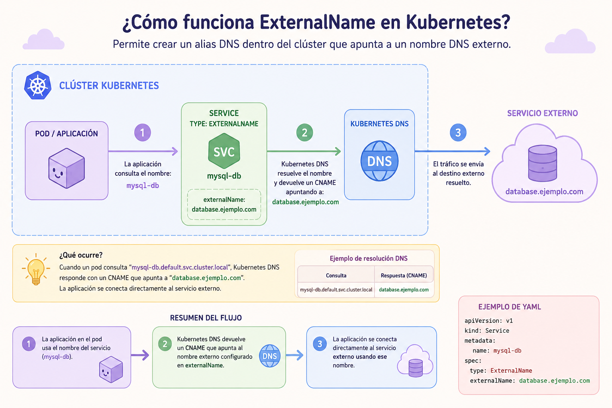
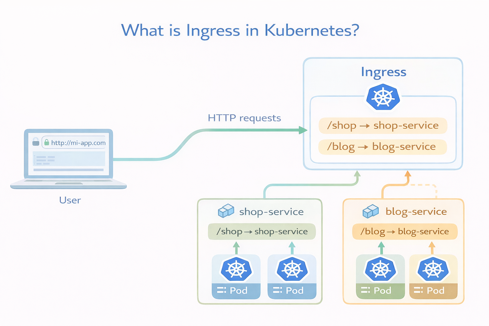
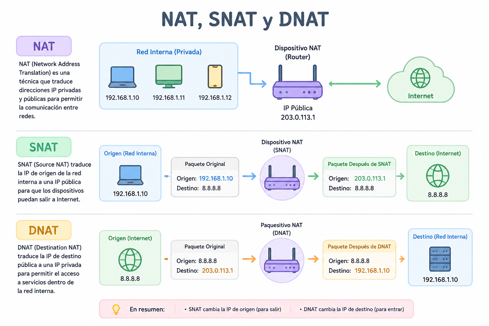
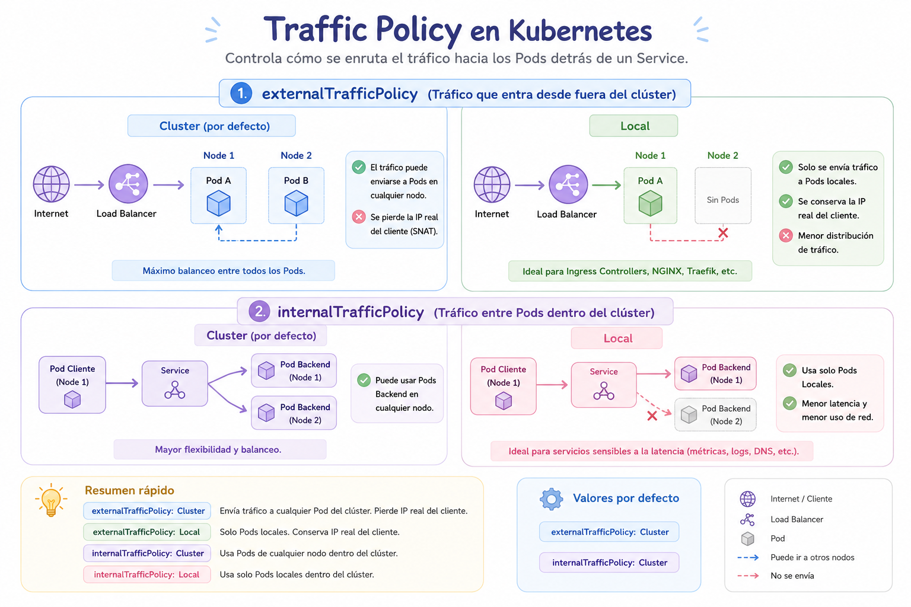
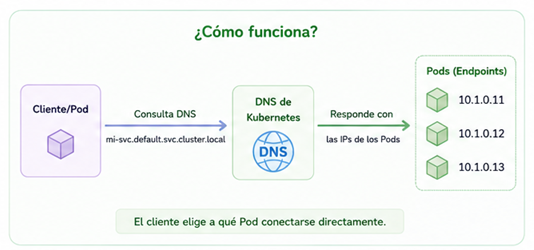

# Networking 

## Container Network Interface (CNI)

Es el sistema que permite que los Pods tengan red y puedan comunicarse entre sí dentro del cluster. El CNI se encarga de:

- Asignarle una dirección IP
- Conectarlo a la red del cluster
- Permitir comunicación con: otros Pods, Servicios, Internet

Sin CNI, los Pods no tendrían red. El kubelet llama al plugin CNI para configurar la red del contenedor. 

CNI mas populares:

|  CNI | Característica |
|---|---|
| Calico  | muy usado, soporta Network Policies  |
|  Flannel | simple y ligero  |
|  Cilium | usa eBPF, muy avanzado  |
|  Weave Net | fácil de instalar  |

## Cluster DNS

Cluster DNS es el sistema interno de resolución de nombres que permite que los Pods y servicios se encuentren usando nombres en lugar de direcciones IP.

Por ejemplo un Pod puede acceder a otro servicio usando algo como:
```
http://mi-servicio
```
En lugar de usar una IP como:
```
http://10.96.0.15
```

**CoreDNS** es el servidor DNS interno que usa Kubernetes para resolver nombres dentro del cluster.

## Servicios

Tenemos 4 tipos de servicios

- **NodePort:** Expone el Servicio en la IP de cada Nodo en un puerto estático.
- **Cluster IP:** Expone el Servicio en una IP interna del clúster. Al elegir este valor, solo se puede acceder al Servicio desde dentro del clúster.
- **Load Balancer:** Expone el Servicio externamente mediante un equilibrador de carga externo. Kubernetes no ofrece directamente un componente de equilibrio de carga; debe proporcionar uno o puede integrar su clúster de Kubernetes con un proveedor de nube.
- **ExternalName:** Asigna el servicio al contenido del campo externalName (por ejemplo, al nombre de host api.foo.bar.example). La asignación configura el servidor DNS de su clúster para devolver un registro CNAME con ese valor de nombre de host externo. No se configura ningún proxy de ningún tipo.

### ClusterIP

<p align="center">

</p>

- Para probar el funcionamiento del servicio tipo ClusterIp vamos a desplegar el siguiente deployment

Creamos el archivo "deployment-definition.yaml" con el siguiente contenido

```
apiVersion: apps/v1
kind: Deployment
metadata:
  name: my-deployment
  labels:
      app: my-deployment
spec:
  replicas: 2
  selector:
    matchLabels:
      app: my-pod
  template:
    metadata:
      labels:
        app: my-pod
    spec:
      containers:
        - name: nginx-container
          image: nginx
          ports:
            - containerPort: 80
```
```
kubectl create -f deployment-definition.yaml
```

Creamos el archivo "cluster-ip.yaml" con el siguiente contenido

```
apiVersion: v1
kind: Service
metadata:
  name: nginx-clusterip
spec:
  type: ClusterIP
  ports:
    - targetPort: 80
      port: 80
  selector:
      app: my-pod
```
```
kubectl apply -f cluster-ip.yaml
```

### Node Port

<p align="center">

</p>

- Para probar el funcionamiento del servicio tipo NodePort vamos a desplegar el siguiente deployment

Creamos el archivo "deployment-definition.yaml" con el siguiente contenido

```
apiVersion: apps/v1
kind: Deployment
metadata:
  name: my-deployment
  labels:
      app: my-deployment
spec:
  replicas: 2
  selector:
    matchLabels:
      app: my-pod
  template:
    metadata:
      labels:
        app: my-pod
    spec:
      containers:
        - name: nginx-container
          image: nginx
          ports:
            - containerPort: 80
```
```
kubectl create -f deployment-definition.yaml
```

Creamos el archivo "node-port.yaml" con el siguiente contenido

```
apiVersion: v1
kind: Service
metadata:
  name: nginx-nodeport
spec:
  type: NodePort
  ports:
    - port: 80
      targetPort: 80
      nodePort: 30007
  selector:
    app: my-pod
```
```
kubectl apply -f node-port.yaml
```


### Load Balancer

<p align="center">

</p>

- Para probar el funcionamiento del servicio tipo Load Balancer vamos a desplegar el siguiente deployment

Creamos el archivo "deployment-definition.yaml" con el siguiente contenido
```
apiVersion: apps/v1
kind: Deployment
metadata:
  name: my-deployment
  labels:
      app: my-deployment
spec:
  replicas: 2
  selector:
    matchLabels:
      app: my-pod
  template:
    metadata:
      labels:
        app: my-pod
    spec:
      containers:
        - name: nginx-container
          image: nginx
          ports:
            - containerPort: 80
```
```
kubectl create -f deployment-definition.yaml
```

Creamos el archivo "load-balancer.yaml" con el siguiente contenido:
```
apiVersion: v1
kind: Service
metadata:
  name: nginx-service-loadbalancer
spec:
  type: LoadBalancer
  selector:
    app: my-pod
  ports:
    - protocol: TCP
      port: 80
      targetPort: 80
```
```
kubectl apply -f load-balancer.yaml
```
- Para ver el DNS de nuestro balanceador usamos
```
kubectl describe svc nginx-service-loadbalancer
```
<p align="center">

</p>
- Esperamos unos minutos que termine de provicionarse nuestro balanceador y vamos a ver el resultado en nuestro navegador

<p align="center">

</p>

## ExternalName

Un servicio de tipo ExternalName en Kubernetes permite crear un alias DNS dentro del clúster que apunta a un nombre DNS externo.

<p align="center">

</p>

- Para probar el funcionamiento del servicio tipo Load Balancer vamos a desplegar el siguiente deployment

Creamos el archivo "externalname.yaml" con el siguiente contenido:

```
apiVersion: v1
kind: Service
metadata:
  name: checkip
spec:
  type: ExternalName
  externalName: checkip.amazonaws.com
```
```
kubectl apply -f externalname.yaml
```

## Ingress

Un Ingress es un recurso que gestiona el acceso HTTP/HTTPS desde fuera del cluster hacia los servicios internos.

El Ingress actúa como un router HTTP/HTTPS que decide a qué servicio enviar cada petición.

Con un Ingress puedes:

- Usar un solo punto de entrada para varias aplicaciones
- Redirigir tráfico según el dominio
- Redirigir tráfico según la ruta (path)
- Manejar HTTPS / TLS
- Aplicar balanceo de carga

<p align="center">

</p>

Tenemos el siguiente ejemplo:
```
apiVersion: apps/v1
kind: Deployment
metadata:
  name: web-deployment
spec:
  replicas: 2
  selector:
    matchLabels:
      app: web
  template:
    metadata:
      labels:
        app: web
    spec:
      containers:
      - name: nginx
        image: nginx:latest
        ports:
        - containerPort: 80
---
apiVersion: v1
kind: Service
metadata:
  name: web-service
spec:
  selector:
    app: web
  ports:
  - port: 80
    targetPort: 80
  type: ClusterIP
---
apiVersion: networking.k8s.io/v1
kind: Ingress
metadata:
  name: web-ingress
spec:
  rules:
  - host: miapp.com
    http:
      paths:
      - path: /
        pathType: Prefix
        backend:
          service:
            name: web-service
            port:
              number: 80
```

## Gateway API

La API de Kubernetes Gateway es la sucesora de la API de Ingress, diseñada para proporcionar un enfoque más expresivo, orientado a roles y portable para la gestión del tráfico. 

La API de Ingress está congelada y ya no se desarrolla, aunque no se eliminará y todavía se usa ampliamente en producción para casos más sencillos.

Un Gateway es un recurso que define cómo entra el tráfico al clúster (HTTP, HTTPS, TCP, etc.), separando claramente:

- Infraestructura (Gateway) → cómo se expone el tráfico
- Rutas (HTTPRoute, TCPRoute, etc.) → a dónde se envía ese tráfico

<p align="center">

</p>

1. GatewayClass: Define qué implementación se usará (ej: Istio, Kong, NGINX)

```yaml
apiVersion: gateway.networking.k8s.io/v1
kind: GatewayClass
metadata:
  name: my-gateway-class
spec:
  controllerName: example.com/gateway-controller
```

2. Gateway: Define el punto de entrada (listener

```yaml
apiVersion: gateway.networking.k8s.io/v1
kind: Gateway
metadata:
  name: my-gateway
spec:
  gatewayClassName: my-gateway-class
  listeners:
  - name: http
    protocol: HTTP
    port: 80
```

3. HTTPRoute (u otras Routes): Define a qué servicio enviar el tráfico

```yaml
apiVersion: gateway.networking.k8s.io/v1
kind: HTTPRoute
metadata:
  name: my-route
spec:
  parentRefs:
  - name: my-gateway
  rules:
  - matches:
    - path:
        type: PathPrefix
        value: /
    backendRefs:
    - name: my-service
      port: 80
```

4. Recursos para el httpRoute

```
apiVersion: apps/v1
kind: Deployment
metadata:
  name: web-deployment
spec:
  replicas: 2
  selector:
    matchLabels:
      app: web
  template:
    metadata:
      labels:
        app: web
    spec:
      containers:
      - name: nginx
        image: nginx:latest
        ports:
        - containerPort: 80
---
apiVersion: v1
kind: Service
metadata:
  name: web-service
spec:
  selector:
    app: web
  ports:
  - port: 80
    targetPort: 80
  type: ClusterIP
```

## Politicas de red (Network policies)

Las Network Policies son reglas de seguridad de red que controlan qué Pods pueden comunicarse entre sí y con otros recursos dentro del cluster.

En otras palabras: Network Policies = firewall para Pods.

Las Network Policies controlan dos tipos de tráfico:

- Ingress:	tráfico que entra al Pod
- Egress:	tráfico que sale del Pod

<p align="center">

</p>


Por ejemplo:

```
apiVersion: networking.k8s.io/v1
kind: NetworkPolicy
metadata:
  name: allow-same-namespace
spec:
  podSelector: {}
  policyTypes:
  - Ingress
  ingress:
  - from:
    - podSelector: {}
```

Qué hace esta política

- Se aplica a Pods con app=backend
- Solo permite tráfico desde Pods con app=frontend
- Todo lo demás queda bloqueado

## NAT

NAT (Network Address Translation) es una técnica de red que permite traducir direcciones IP privadas a direcciones IP públicas, o viceversa.

Su principal objetivo es que múltiples dispositivos de una red privada puedan compartir una o pocas direcciones IP públicas para acceder a Internet.

<p align="center">

</p>


## Traffic Policy

En Kubernetes, Traffic Policy define cómo se enruta el tráfico hacia los Pods detrás de un Service. Los dos valores más comunes son:

- Cluster
- Local

Se utiliza principalmente en:

- externalTrafficPolicy
- internalTrafficPolicy

<p align="center">

</p>


### 1. externalTrafficPolicy

Controla cómo se maneja el tráfico que entra desde fuera del clúster a través de un Service de tipo LoadBalancer o NodePort.

#### externalTrafficPolicy: Cluster (por defecto)

```
spec:
  type: LoadBalancer
  externalTrafficPolicy: Cluster
```

**Escenario**

Supongamos:

```
Node1
 └─ Pod A

Node2
 └─ Pod B
```

El Load Balancer envía una petición a Node2.

```
Cliente
   │
   ▼
LoadBalancer
   │
   ▼
Node2
```

Kube-proxy puede:
```
Node2 → Pod B
```
o
```
Node2 → Pod A
```

aunque Pod A esté en otro nodo.

Ventajas

- Balanceo uniforme entre todos los Pods.

Desventajas

- Se pierde la IP original del cliente.

El Pod verá algo similar a:
```
10.244.1.5
```
en lugar de:
```
190.x.x.x
```
porque ocurre SNAT.

#### externalTrafficPolicy: Local

```
spec:
  type: LoadBalancer
  externalTrafficPolicy: Local
```

Ahora Kubernetes solo enviará tráfico a Pods locales.

```
Node1
 └─ Pod A

Node2
 └─ (sin pods)
```
Si el Load Balancer envía tráfico a Node2:

```
Cliente
   │
   ▼
Node2
```

Node2 NO reenviará el tráfico a Node1.

Resultado:
```
Request descartada
```
Por eso el Load Balancer aprende qué nodos tienen Pods activos.

Ventajas

- Conserva la IP real del cliente.
```
Cliente 190.50.20.10
         │
         ▼
Pod A ve 190.50.20.10
```
- Ideal para:

  - Ingress Controllers
  - NGINX
  - Traefik
  - HAProxy
  - Aplicaciones que necesitan geolocalización
  - Auditoría y logs

Desventajas

- Menor distribución de tráfico.

- Puede haber nodos infrautilizados.

### 2. internalTrafficPolicy

Controla el tráfico interno entre Pods del clúster.

#### internalTrafficPolicy: Cluster

Valor por defecto:
```
spec:
  internalTrafficPolicy: Cluster
```

Ejemplo

```Node1
 ├─ App Pod
 └─ Service

Node2
 └─ Backend Pod
```
La aplicación puede consumir el backend aunque esté en otro nodo.
```
App
 │
 ▼
Service
 │
 ▼
Backend Pod (Node2)
```

#### internalTrafficPolicy: Local

```
spec:
  internalTrafficPolicy: Local
```

Ahora Kubernetes intentará usar únicamente Pods locales.

Escenario
```
Node1
 ├─ App Pod
 └─ Backend Pod

Node2
 ├─ App Pod
 └─ Backend Pod
```

Cuando App Node1 llama al Service:

```
App Node1
     │
     ▼
Backend Node1
```

No cruzará la red hacia Node2.

Beneficios

- Menor latencia.

- Menor consumo de red.

- Mejor rendimiento.

- Muy usado en:

  - Observabilidad
  - Métricas
  - Logging
  - DNS
  - DaemonSets

### Resumen rápido

| Traffic Policy        | Valor   | Comportamiento                                |
| --------------------- | ------- | --------------------------------------------- |
| externalTrafficPolicy | Cluster | Puede enviar tráfico a Pods en cualquier nodo |
| externalTrafficPolicy | Local   | Solo Pods del mismo nodo, preserva IP cliente |
| internalTrafficPolicy | Cluster | Puede usar Pods de cualquier nodo             |
| internalTrafficPolicy | Local   | Solo usa Pods locales                         |
| Valor por defecto     | Cluster | Máximo balanceo                               |
| Mejor para Ingress    | Local   | Conserva IP real del cliente                  |

## Headless

Un Headless Service en Kubernetes es un Service que no tiene una IP virtual (ClusterIP). En lugar de actuar como un balanceador de carga, devuelve directamente las IPs de los Pods asociados.

<p align="center">

</p>


Se crea configurando:

```
apiVersion: apps/v1
kind: Deployment
metadata:
  name: nginx-deployment
spec:
  replicas: 4
  selector:
    matchLabels:
      app: nginx
  template:
    metadata:
      labels:
        app: nginx
    spec:
      containers:
      - name: nginx
        image: nginx:latest
        ports:
        - containerPort: 80
---
apiVersion: v1
kind: Service
metadata:
  name: mi-headless-service
spec:
  clusterIP: None
  selector:
    app: nginx
  ports:
  - port: 80
    targetPort: 80
```

Arrancamos el siguiente pod para realizar la prueba

```
kubectl run dns-test --image=busybox:1.36 --restart=Never -it --rm -- sh
```
Realizamos nslookup para revisar la lista de ips
```
nslookup mi-headless-service.default.svc.cluster.local
```
### ¿Qué hace un Headless Service?

Cuando se usa clusterIP: None, Kubernetes no crea una IP virtual.

En su lugar, el DNS responde con las IPs reales de los Pods:

```
Cliente
   |
   +----> Pod A (10.244.1.10)
   |
   +----> Pod B (10.244.2.15)
   |
   +----> Pod C (10.244.3.20)
```

Por ejemplo:
```
nslookup mi-headless-service.default.svc.cluster.local
```

```
10.244.1.10
10.244.2.15
10.244.3.20
```

#### ¿Por qué existe?

Algunas aplicaciones necesitan conocer exactamente qué instancia están contactando.

Ejemplos:

- Bases de datos distribuidas.
- Clústeres de mensajería.
- Sistemas de consenso.
- Service Meshes.
- Aplicaciones Stateful.

No quieren un balanceador delante porque necesitan conectarse a nodos específicos.

## Proxy

Un proxy es un intermediario entre un cliente (tu dispositivo) y un servidor (Internet).

En lugar de que tu computadora se conecte directamente a una página web, primero se conecta al proxy, y este es el que hace la solicitud por ti.


Sin proxy:
```
Tu PC  ───────────►  Internet (Google, etc.)
```
Con proxy:
```
Tu PC ───► Proxy ───► Internet
      ◄─── Proxy ◄───
```

### Envoy Proxy 

Es el proxy más importante del ecosistema cloud native.

- Proxy L7 (HTTP, gRPC, TCP)
- Edge proxy / service proxy / sidecar
- Base de muchos otros proyectos CNCF
- Usado como “data plane” en service mesh como Istio

Es el estándar de facto de proxies modernos en Kubernetes.
