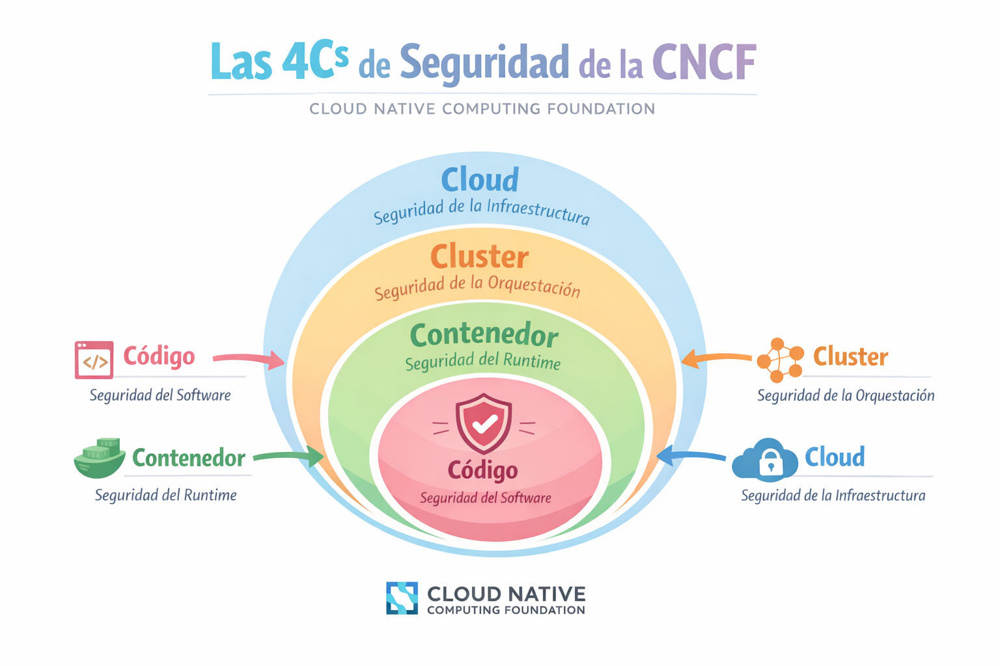
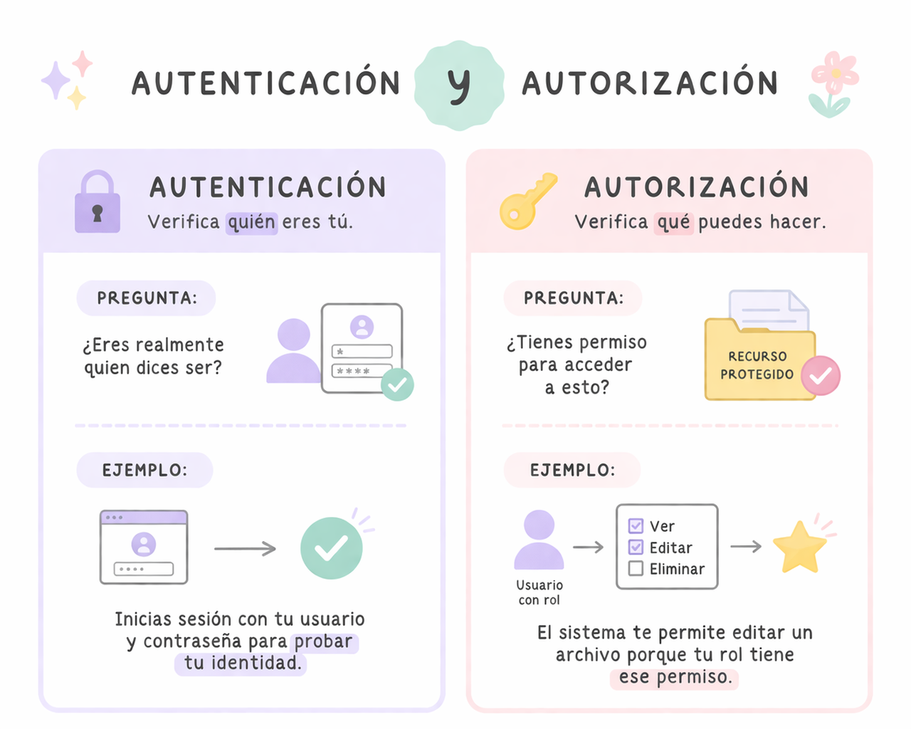

# Seguridad

La seguridad en Kubernetes consiste en proteger el cluster, los contenedores, la red y el acceso de los usuarios para evitar accesos no autorizados o ataques.

Kubernetes cumple con las directrices de CNCF sobre las mejores prácticas en seguridad de la información nativa de la nube.

# Las 4C’s de seguridad de la Cloud Native Computing Foundation (CNCF)

Es un modelo que explica cómo debe abordarse la seguridad en entornos cloud-native y contenedores.

- Cloud: Es la base de todo el sistema. Incluye la seguridad del proveedor de infraestructura.
- Clusters: Es la seguridad del cluster de Kubernetes.
- Containers: Esta capa protege los contenedores y las imágenes.
- Code: Es la seguridad del código de la aplicación.

## Autenticación

La autenticación es el proceso mediante el cual el cluster verifica la identidad de quien intenta acceder al API Server

Kubernetes no administra la gestión de usuarios o grupos

Métodos de autenticación:
- **Certificados TLS (Certificados X.509):** Autenticación de usuarios y componentes mediante certificados de cliente TLS. kubectl usa este método.   
- **Tokens:** Uso de bearer tokens para autenticación no interactiva.
- **Service Accounts**: Los Pods se autentican con Service Accounts.
- **OpenID Connect (OIDC):** Permite autenticación con proveedores externos de identidad como: Google, Microsoft, Keycloack.

## Autorización

La autorización es el proceso que determina qué acciones puede realizar un usuario o proceso dentro del cluster después de que su identidad ya fue verificada.

Métodos de autorización:
- **Node Authorization:** Permite que los nodos del cluster accedan solo a los recursos que necesitan.
- **RBAC:** Es el sistema más común es Role-Based Access Control, que funciona con roles y permisos
- **ABAC:** Attribute-Based Access Control usa reglas basadas en atributos.
- **Webhook Authorization:** El API Server puede consultar un servicio externo para decidir permisos.

## Autorización RBAC

La API RBAC declara cuatro tipos de objetos:

- Role: Un Role define permisos dentro de un namespace específico. Sirve para indicar qué acciones se pueden realizar sobre qué recursos.
- ClusterRole: Un ClusterRole define permisos a nivel de todo el cluster.
- RoleBinding: Un RoleBinding conecta (Usuario o Grupo o ServiceAccount) → Role
- ClusterRoleBinding: Un ClusterRoleBinding conecta (Usuario o Grupo o ServiceAccount) → ClusterRole

Práctica recomendada: Regla de los privilegios minimos (Otorgar solo los permisos necesarios para que cada usuario o componente realice sus tareas).
